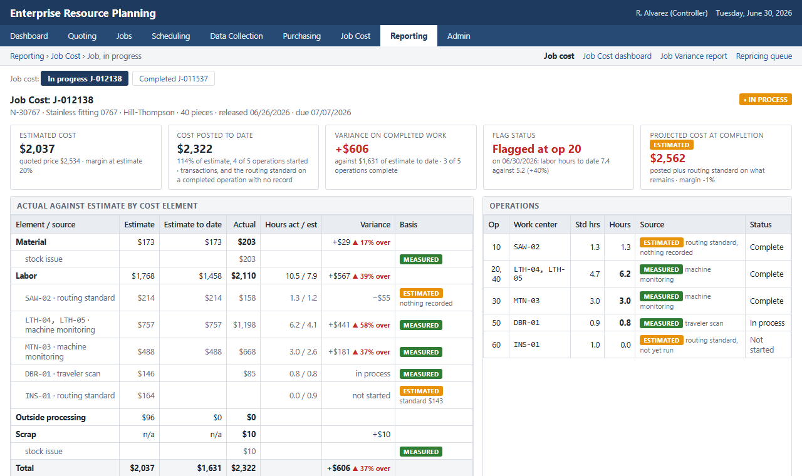

# mfg-data-engineering

Data engineering for small manufacturers: records cleaned, joined across the systems that do not share a key, and rebuilt by pipeline, with the analysis the finished record makes possible. Three engagements, each in its own folder: defects and scrap at a sheet-metal fabricator, OEE and machine health at a precision machining shop, and job costing at a second machining shop.

## What is included

[`defects_scrap/`](defects_scrap/)

| Shop | Source systems | Data engineering | Analytics and ML | Deliverables |
|---|---|---|---|---|
| Sheet-metal fabricator, about $31M, two shifts | ERP, MES, QMS, materials receiving, HR | Five extracts cleaned, identifiers reconciled (part numbers keyed five ways, lot ids four), joined on the work order; data quality findings carried onto the figures; monthly flow that stages, tests and republishes | Defect and scrap rates by the operating conditions the joined record exposes: six conditions measured with intervals and costed, from off-gauge material lots to first runs and skipped first-piece checks | Analytics diagnostic report; KPI dashboard (weekly, monthly, trailing twelve months) |

[`oee_downtime/`](oee_downtime/)

| Shop | Source systems | Data engineering | Analytics and ML | Deliverables |
|---|---|---|---|---|
| Precision machining shop, about $40M, twelve CNC machines in three cells | MES machine state, IIoT sensors, CMMS, ERP, HR | Five extracts typed and standardized, three operator identifiers reconciled, PMs without a schedule flagged, conformed into one modeled record of machine state, orders, maintenance, sensor readings and operators, rebuilt monthly | OEE by machine with its components, downtime Pareto and cost, PM compliance, cross-system findings (alarms against PM status, shift-start stoppages); a machine health indicator, two calibrated gradient-boosted classifiers rating each machine daily at 7 and 21 days, evaluated against a repair-interval rule and the calendar PM schedule, rescored and monitored monthly | CMMS asset list with the health indicator; analytics diagnostic report; KPI dashboard; ML model overview; ML technical report; MLOps monitoring report |

[`job_costing/`](job_costing/)

| Shop | Source systems | Data engineering | Analytics and ML | Deliverables |
|---|---|---|---|---|
| Precision machining shop, about $56M, 28 CNC work centers | ERP (quoting, routing, data collection, job costing), machine-monitoring feed | Seventeen error types found and remediated across the ERP's ten job costing tables; estimate carried to the job, rate pools by work center, machine hours posted to jobs, outside processing coded to jobs; one flow that stages, tests, rebuilds the marts and recalculates current cost monthly | Job costing implemented in the ERP's reporting layer; margin by job, part, customer, element and work center against estimate; what the blended rate hid; the in-progress flag replayed; the repricing review with decisions; the jobs that lost money with an action each | Job cost screen (in progress and completed); Job Cost dashboard; Job Variance report; repricing queue; report on the ERP implementation and data quality audit; margin analytics diagnostic |

Each folder carries its own README with the shop, the business context, the findings, the data and how to run. This page covers what the three have in common.

## Business context

The three shops ran between two and five systems that did not share a key. Machine monitoring recorded downtime and cycle time by machine and minute; the ERP recorded jobs, parts, routings and operators by work order; the CMMS recorded maintenance by asset; HR recorded shifts and tenure by employee; quality recorded inspections and scrap by part and lot; accounting carried the job cost. Each system produced its own report and each report answered questions inside its own system. The questions that crossed systems, and the questions that needed a record cleaner than the one the system kept, went unanswered.

The fabricator ([`defects_scrap/`](defects_scrap/)) was about to take a supplier finding from its monthly quality report into a sourcing decision. On the joined record the supplier finding was a material finding, with five more conditions beside it, each measured and costed.

The first machining shop ([`oee_downtime/`](oee_downtime/)) was weighing whether to rebuild or replace its three oldest mills without a measured basis. On the joined record the OEE shortfall split evenly between availability and performance, 69% of unplanned downtime traced to tooling and mechanical failures, and two findings needed the cross-system join: alarms against overdue PMs and stoppages at the start of each shift. The same record carries the machine health indicator that now sits in the CMMS.

The second machining shop ([`job_costing/`](job_costing/)) had one margin figure for the year and nothing beneath it. Its ERP's job costing module had never been set up, so the engagement configured the system it had, repaired three years of history with every correction logged, and built the margin analytics on the corrected record.

## Methods

Data engineering: raw system exports profiled and loaded to DuckDB; dbt staging, intermediate and mart models with schema and relationship tests on every layer; entity resolution across systems on machine, part, operator, lot and work order; deduplication and conformance of keys that each system spelled its own way; coverage measured and carried onto every figure where the record is partial; a data quality audit per case that reports what the systems agree on, where they disagree, and what was repaired, flagged or left; Prefect flows from export to published page; one build command per case that regenerates every table, figure and page from the committed inputs.

Analysis: OEE with availability, performance and quality components by machine, shift and part; downtime attribution across systems with cost; defect and scrap rate analysis with intervals across operating-condition combinations; scrap cost by cause and work center; estimated against actual cost by job, part, customer, element and work center with the margin distribution and rule-assigned drivers; a machine health indicator (two calibrated gradient-boosted classifiers, time-based split, thresholds set against a rule the shop could run without a model) with monthly scoring, drift monitoring and a rules-based retraining decision.

## Data

- [`defects_scrap/`](defects_scrap/): ERP, MES, QMS, materials receiving and HR, January 2023 to March 2026. 36,492 production orders, 67,201 inspection records, 19,487 scrap events, 1,012 material lots, 786 parts, 7 machines and 26 operators.
- [`oee_downtime/`](oee_downtime/): MES machine state, IIoT sensors, CMMS, ERP and HR, January 2023 to March 2026. 741,064 machine state events, 12,192 sensor readings, 11,142 work orders, 1,554 maintenance records, 12 machines and 20 operators.
- [`job_costing/`](job_costing/): ERP and machine-monitoring feed, July 2023 to June 2026. 12,181 jobs, 40,824 quote lines, 256,208 labor transactions, 51,224 material transactions, 11,468 outside-processing lines, 2,575 scrap and rework events and 1,596,676 machine-monitoring records.

The records carry what these systems carry in practice: downtime codes left at the default, work orders closed days after the work, part numbers spelled differently in the ERP and the quality system, inspections logged against the wrong operation, maintenance work orders without a schedule, clock records that run across breaks and shifts, purchase orders without a job number, and employees whose shift in HR differs from the shift that ran the job. The audits list these; the analyses work with the record as it stands and say so where it limits a finding. Each folder's README states where its data comes from.

## How to run

Each folder is self-contained: see its README for install, data, `dbt build` and the build command.

## Author

Brian Davis. Data engineering and applied analytics/ML for manufacturers. Other work: [github.com/brimsystems](https://github.com/brimsystems?tab=repositories).
