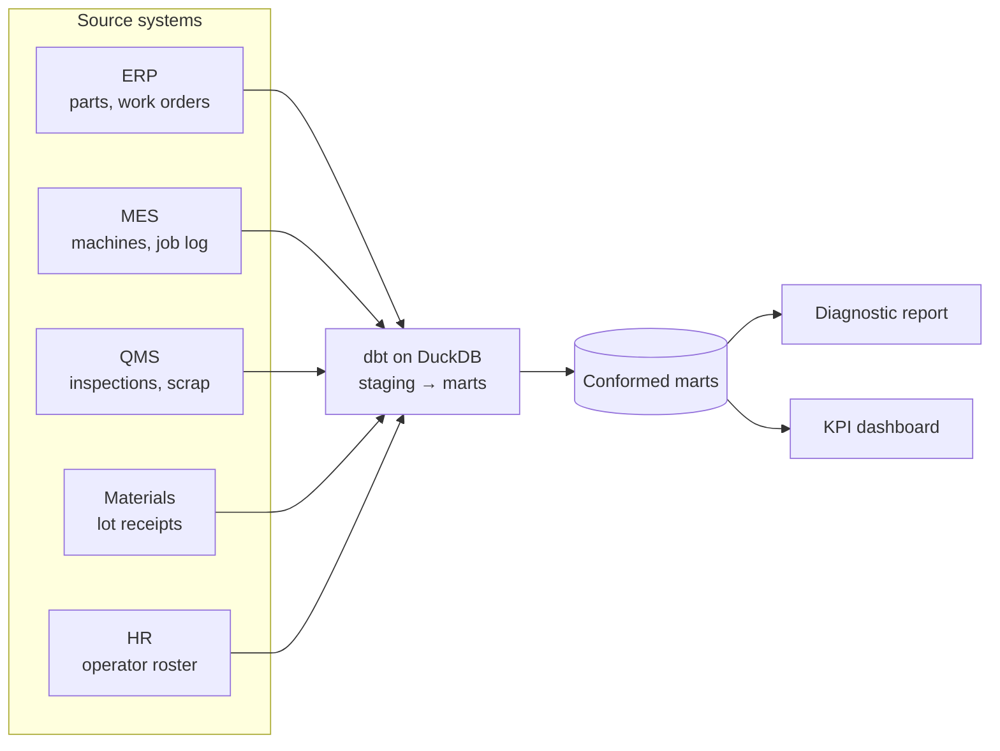

# Defects & Scrap Costs

**Data engineering and analytics for a sheet-metal fabrication shop, applied to defect rates and scrap cost.**

The work began with **comprehensive data cleaning** of all five source systems (ERP, MES, QMS, Materials, HR): inaccurate entries were corrected, inconsistent formats were standardized, duplicate rows were removed, and blank values were filled or flagged.

A **data pipeline** was then built that integrates order, machine, inspection, material and operator data from the five disconnected systems into a single modeled dataset.

The pipeline is then **automated**: a monthly flow stages and tests each extract, rebuilds the marts and regenerates the report and dashboard.

An **analytics layer** is built on the cleaned and integrated data:

1. **Analytics diagnostic report** on the six conditions that raise the defect rate, with each multiplier and what it costs
2. **KPI dashboard** tracking defects, defect rate and scrap cost by week, month and trailing twelve months, with trailing-twelve-month trends

[](https://brimsystems.github.io/mfg-data-engineering/defects_scrap/docs/reports/dashboard.html)

> **[Open the diagnostic report →](https://brimsystems.github.io/mfg-data-engineering/defects_scrap/docs/reports/report.html)** · **[Open the dashboard →](https://brimsystems.github.io/mfg-data-engineering/defects_scrap/docs/reports/dashboard.html)** · **[Both deliverables →](https://brimsystems.github.io/mfg-data-engineering/defects_scrap/)**

---

## Business Context

A sheet-metal fabricator of about $31M revenue ran two lasers, two press brakes, two welding stations and a punch press on two shifts, cutting, forming and welding lots of 5 to 25 pieces for eight customers. Over the trailing twelve months its defect rate at final inspection was 6.3% against a target of 4.5%, and scrap and rework cost $640K a year, 2.06% of revenue. The quality manager's monthly report cut the figure three ways. By supplier, one of four suppliers ran at 1.21× the others. By part complexity, complex parts ran at 1.40× simple ones. By shift, the two were level. The shop was preparing to take the supplier figure into a sourcing decision.

Before it did, it wanted to know whether the material or something on the floor was the cause, and that question could not be answered from any one of its systems. The ERP held the part master and work orders, the MES clocked each job at the machine, the QMS held inspections and scrap events, receiving logged each lot of sheet with its cert and a micrometer check, and HR kept the operator roster. The same part number was keyed five ways across them, lot ids in four, operator names sat in id fields, the inspection system held duplicate final entries, 4% of job clock entries ran backwards, the lot was not scanned on 15% of work orders, and the ERP start time was entered late on about 30%. Whether a skipped first-piece check, a gauge change on a brake, a new drawing, an old lot or a new operator cost anything needed two or three of these systems on the same row, and nobody had joined them.

The project cleaned each system's extract, reconciled the identifiers and joined the five on the work order, rebuilt by a monthly flow that stages, tests and republishes the report and dashboard. On that record the supplier finding turned out to be a material finding: off-gauge lots raise bend-angle defects on the brakes from any supplier, and the elevated supplier simply ships more of them. Five more conditions came with it, each measured with its interval and costed: first runs of new or revised parts, the first brake job after a gauge change, jobs with no first-piece inspection, operators in their first jobs on a machine type, and gauge steel held past 60 days. Jobs with none of the six present run at 3.8%; jobs with three or more run at 19.5%. Bringing each condition to its comparison rate is worth about $263K a year before overlap, and the dashboard now tracks all six by week, month and trailing twelve months.

---

## Deliverables

| # | Deliverable | What it is | Links |
|---|---|---|---|
| 1 | Analytics diagnostic report | Six conditions that raise the defect rate, each measured on the joined record with its composition, its defect codes and its cost, followed by the financial impact. | [View](https://brimsystems.github.io/mfg-data-engineering/defects_scrap/docs/reports/report.html) |
| 2 | KPI dashboard | Weekly, monthly and trailing-twelve-month tiles for defects and scrap cost, and trailing-twelve-month trends by supplier and lot deviation, defect code, machine and disposition. | [View](https://brimsystems.github.io/mfg-data-engineering/defects_scrap/docs/reports/dashboard.html) |

---

## Code

### Data pipeline: [`data_pipeline/models/`](data_pipeline/models/)

| Layer | What it is, does and contains |
|---|---|
| Staging | One model per source table (ERP, MES, QMS, Materials, HR). Each cleans the raw extract into a consistent shape: part numbers and lot ids normalized, names in id fields resolved through the HR roster, reversed job clock entries corrected and flagged, duplicate final inspections removed. |
| Intermediate | Work orders joined to the job log and the final inspection, then enriched from every system: run position on the drawing revision, the operator's experience on the machine type, hours into the operator's day, the thickness of the job before on the machine, lot deviation and age. Scrap and rework cost by event. |
| Marts | Analysis-ready tables the report and dashboard read: defect rates by work order with every finding dimension, scrap events, operator summary, defect codes by month and machine type, cost concentration by part and customer, and lot receipts. |

---

## How it works



Raw extracts from the five systems are staged, tested and conformed by a dbt pipeline into marts. The marts feed the diagnostic report and the dashboard. Every multiplier in the report is a group's defect rate over its comparison group's, with an interval from a bootstrap over jobs.

The monthly flow is defined in [`pipeline_flow.py`](pipeline_flow.py), with its schedule (first weekday of the month, 06:00).

---

## Data

The datasets were generated to represent typical records from the source systems involved (ERP, MES, QMS, Materials receiving and HR), so the full workflow can be demonstrated on data that is safe to share publicly; the [generators are in `data_source/generate/`](data_source/generate/).

---

## Running it locally

```bash
# 1. Environment
python3 -m venv .venv
source .venv/bin/activate          # Windows: .venv\Scripts\activate
pip install -e .                   # project + dependencies from pyproject.toml

# 2. Generate data and build the warehouse
python3 -m data_source.generate.run_generator
python3 -m data_source.generate.checks        # optional: the checks on the source tables
cd data_pipeline && dbt build && cd ..

# 3. Analytics (diagnostic report + dashboard)
cd analytics/reports && python3 generate_report.py && python3 generate_dashboard.py && cd ../..

# 4. Optional: the README screenshot (needs pip install -e ".[dev]")
python3 analytics/reports/capture_dashboard_screenshot.py

# 5. The monthly flow: dbt build, the report and the dashboard in one run
python3 pipeline_flow.py
```

The report generators write standalone HTML; the copies served by GitHub Pages live under [`docs/`](docs/).

---

## Stack

| Layer | Tools |
|---|---|
| Integration & transformation | dbt, DuckDB |
| Analytics & reporting | Python, pandas, matplotlib, HTML/CSS |
| Orchestration | Prefect |
| Delivery | Static HTML, GitHub Pages |

---

Brian Davis. Data engineering and applied analytics/ML for manufacturers. Other work: [github.com/brimsystems](https://github.com/brimsystems?tab=repositories).
