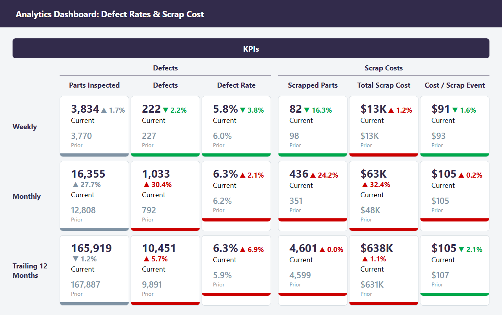
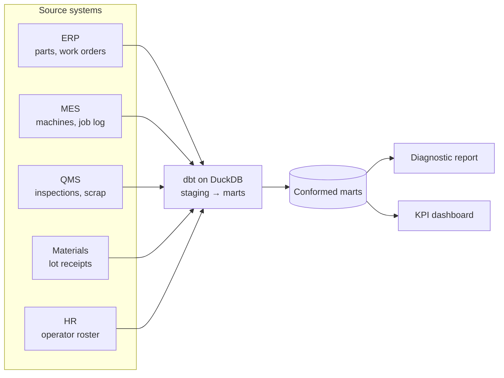

# Manufacturing Data Platform: Defects & Scrap Cost

**An end-to-end data platform for a sheet-metal fabrication shop, spanning data engineering and analytics, applied to defect rates and scrap cost.**

Five systems that recorded the floor independently, with part numbers keyed in five formats, lot ids in four, operator names typed into id fields, final inspections entered twice and job clock entries reversed, were cleaned, reconciled and joined on the work order into one modeled record. On that record the shop measured a 6.0% defect rate at final inspection and $640K a year in scrap and rework, 2.06% of revenue, and found six conditions that raise the defect rate: lots 2% or more off nominal thickness on the brakes (1.83× the bend-angle rate), the first run of a new or revised part (2.15×), the first brake job after a gauge change (1.78×), jobs with no first-piece inspection (2.00×), operators in their first 50 jobs on a machine type (1.95×), and gauge steel on lots 60 days or older (1.39×). Bringing each to its comparison rate is worth about $263K a year before overlap.

The pipeline is automated rather than a one-time pull: a monthly flow stages and tests each extract, rebuilds the marts and regenerates the report and dashboard, so every figure rebuilds from the source extracts with the same commands.

It starts with a **data pipeline** that integrates order, machine, inspection, material and operator data from five disconnected systems into a single modeled dataset:

- **ERP**: the part master (customer, material, complexity, standard setup, unit price, release date, current drawing revision) and work orders (part and revision, quantity, machine, operator, lot scanned at job start, order and due dates, rush flag, start and end times).
- **MES** (shop floor data collection): the machine register, and a job log with one row per work order as clocked at the machine: operator badge, job start and end, setup and run minutes, and the program or tool set.
- **QMS**: final and first-piece inspection records (quantity inspected, passed and failed, defect code, disposition), and scrap, rework and use-as-is events with their reason and estimated cost.
- **Materials receiving**: lot receipts with supplier, material, receipt date, cert status, and the micrometer thickness check against nominal.
- **HR**: the operator roster with hire date, shift, primary and secondary machine type, and certification level.

The joins are what turn five reports into one. Thickness deviation is recorded at receiving and defects at inspection, so the off-gauge finding needs Materials, the ERP lot scan and the QMS; first runs need the ERP revision on each order against the QMS result; the gauge-change finding needs the MES job sequence on each brake with the ERP material; the first-piece and long-day findings need the QMS inspection types with the ERP rush flag and the MES job log; experience needs the HR hire date and machine types with the MES job log; and lot age needs the Materials receipt date with the ERP lot scan. None of the six can be seen from one system.

An **analytics layer** is then built on the integrated record:

1. **Analytics diagnostic report** on the six conditions that raise the defect rate, with each multiplier, its interval and what it costs
2. **KPI dashboard** tracking defect rate, scrap cost and the six conditions by week, month and trailing twelve months

[](https://brimsystems.github.io/mfg-data-engineering/defects_scrap/docs/reports/dashboard.html)

> **[Open the diagnostic report →](https://brimsystems.github.io/mfg-data-engineering/defects_scrap/docs/reports/report.html)** · **[Open the dashboard →](https://brimsystems.github.io/mfg-data-engineering/defects_scrap/docs/reports/dashboard.html)** · **[Both deliverables →](https://brimsystems.github.io/mfg-data-engineering/defects_scrap/)**

---

## Business Context

A sheet-metal fabricator of about $31M revenue ran two lasers, two press brakes, two welding stations and a punch press on two shifts, a high-mix shop cutting, forming and welding lots of 5 to 25 pieces. Five systems recorded the floor. The ERP held the part master and the work orders. The MES clocked each job at the machine. The QMS held inspections and scrap events. Receiving logged each lot of sheet with its cert and a micrometer check. HR kept the operator roster. The same part number was keyed five ways, the lot was not scanned on 15% of work orders, the ERP start time was entered late on about 30% of orders, and the inspection system held duplicate entries, so a question that crossed systems was answered by hand, when it was answered at all.

The shop's reporting showed it. Scrap was cut three ways: by supplier, where one supplier ran at 1.21× the others; by part complexity, where complex parts ran at 1.40× simple ones; and by shift, where the two shifts were level. None of the three said what to change on the floor. Whether a skipped first-piece check, a gauge change on a brake, a new drawing, an old lot or a new operator cost anything had not been measured, because each needed two or three systems on the same row.

The engagement built a tested pipeline that cleans each system's extract, reconciles the identifiers, and joins the five on the work order, rebuilt by a monthly flow. On that record the shop has its defect rate and scrap cost by the conditions that drive them, a restatement of its own three views (the supplier's elevation is its off-gauge lots; complexity is a real but separate effect; the two shifts are level, and stay level among experienced operators), six findings each with a measured multiplier and a costed action, and a dashboard that tracks whether those conditions are getting better or worse.

---

## Deliverables

| # | Deliverable | What it is | Links |
|---|---|---|---|
| 1 | Analytics diagnostic report | Six conditions that raise the defect rate, each measured on the joined record with its interval, its composition, its defect codes and its cost, followed by the financial impact and the levers. | [View](https://brimsystems.github.io/mfg-data-engineering/defects_scrap/docs/reports/report.html) |
| 2 | KPI dashboard | Weekly, monthly and trailing-twelve-month tiles for defects and scrap cost, and trailing-twelve-month trends by supplier and lot deviation, defect code, machine and disposition. | [View](https://brimsystems.github.io/mfg-data-engineering/defects_scrap/docs/reports/dashboard.html) |

---

## Code

### Data pipeline: [`data_pipeline/models/`](data_pipeline/models/)

| Layer | What it is, does and contains |
|---|---|
| Staging | One model per source table (ERP, MES, QMS, Materials, HR). Each cleans the raw extract into a consistent shape: part numbers and lot ids normalized, names in id fields resolved through the HR roster, reversed job clock entries corrected and flagged, duplicate final inspections removed. |
| Intermediate | Work orders joined to the job log and the final inspection, then enriched from every system: run position on the drawing revision, the operator's experience on the machine type, hours into the operator's day, the thickness of the job before on the machine, lot deviation and age. Scrap and rework cost by event. |
| Marts | Analysis-ready tables the report and dashboard read: defect rates by work order with every finding dimension, scrap events, operator summary, defect codes by month and machine type, cost concentration by part and customer, and lot receipts. |

### Analytics: [`analytics/reports/`](analytics/reports/)

| File | What it does |
|---|---|
| `findings.py` | Computes every table behind the report from the marts: rates, multipliers with bootstrap intervals, composition, defect-code mix, monthly series and savings. |
| `generate_report.py` | Draws the charts and writes the diagnostic report. |
| `generate_dashboard.py` | Builds the KPI tiles and trend charts and writes the dashboard. |

---

## How it works



Raw extracts from the five systems are staged, tested and conformed by a dbt pipeline into marts. The marts feed the diagnostic report and the dashboard. Every multiplier in the report is a group's defect rate over its comparison group's, with an interval from a bootstrap over jobs.

The monthly flow is defined in [`pipeline_flow.py`](pipeline_flow.py), with its schedule (first weekday of the month, 06:00).

---

## Data

The datasets were generated to represent typical records from the source systems involved (ERP, MES, QMS, Materials receiving and HR), so the full workflow can be demonstrated on data that is safe to share publicly; the [generators are in `data_source/generate/`](data_source/generate/).

---

## Running it locally

```bash
# 1. Environment
python3 -m venv .venv
source .venv/bin/activate          # Windows: .venv\Scripts\activate
pip install -e .                   # project + dependencies from pyproject.toml

# 2. Generate data and build the warehouse
python3 -m data_source.generate.run_generator
python3 -m data_source.generate.checks        # optional: the checks on the source tables
cd data_pipeline && dbt build && cd ..

# 3. Analytics (diagnostic report + dashboard)
cd analytics/reports && python3 generate_report.py && python3 generate_dashboard.py && cd ../..

# 4. Optional: the README screenshot (needs pip install -e ".[dev]")
python3 analytics/reports/capture_dashboard_screenshot.py

# 5. The monthly flow: dbt build, the report and the dashboard in one run
python3 pipeline_flow.py
```

The report generators write standalone HTML; the copies served by GitHub Pages live under [`docs/`](docs/).

---

## Stack

| Layer | Tools |
|---|---|
| Integration & transformation | dbt, DuckDB |
| Analytics & reporting | Python, pandas, matplotlib, HTML/CSS |
| Orchestration | Prefect |
| Delivery | Static HTML, GitHub Pages |

---

Brian Davis. Data engineering and applied analytics/ML for manufacturers. Other work: [github.com/brimsystems](https://github.com/brimsystems?tab=repositories).
