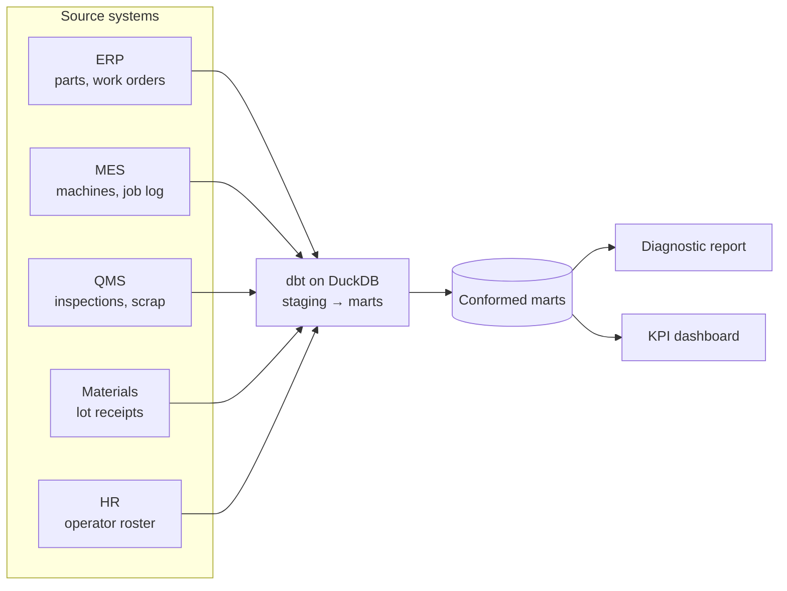

# Defects & Scrap Costs

**Data engineering and analytics for a sheet-metal fabrication shop, applied to defect rates and scrap cost.**

The work began with **comprehensive data cleaning** of all five source systems (ERP, MES, QMS, Materials, HR): inaccurate entries were corrected, inconsistent formats were standardized, duplicate rows were removed, and blank values were filled or flagged.

A **data pipeline** was then built that integrates order, machine, inspection, material and operator data from the five disconnected systems into a single modeled dataset.

The pipeline is then **automated**: a monthly flow stages and tests each extract, rebuilds the marts and regenerates the report and dashboard.

An **analytics layer** is then built on the integrated record:

1. **Analytics diagnostic report** on the six conditions that raise the defect rate, with each multiplier and what it costs
2. **KPI dashboard** tracking defects, defect rate and scrap cost by week, month and trailing twelve months, with trailing-twelve-month trends

[](https://brimsystems.github.io/mfg-data-engineering/defects_scrap/docs/reports/dashboard.html)

> **[Open the diagnostic report →](https://brimsystems.github.io/mfg-data-engineering/defects_scrap/docs/reports/report.html)** · **[Open the dashboard →](https://brimsystems.github.io/mfg-data-engineering/defects_scrap/docs/reports/dashboard.html)** · **[Both deliverables →](https://brimsystems.github.io/mfg-data-engineering/defects_scrap/)**

---

## Business Context

A sheet-metal fabricator (~$31M revenue) ran two press brakes, two welding stations, two laser cutting machines, and a punch press on two shifts. Over the past 12 months, the shop's defect rate was ~6.3%, above its target of 4.5%. It had a rough idea of why defect rates were elevated: jobs run on material sourced from a single supplier had a 1.2x elevated defect rate compared to other suppliers, and high-complexity parts had a 1.4x elevated defect rate compared to low-complexity parts.

With its current data collection infrastructure, the shop wasn't able to get more information on the root causes of its elevated defect rates. Data was spread across five disconnected systems: ERP, MES, QMS, Receiving and HR. Data quality was an issue across the five systems, and none of these systems were connected, so data pulls were manual, and higher level analysis wasn't possible.

As a result of this project, the data was cleaned, integrated and automated, producing a central data repository off of which a diagnostic analysis was completed. The diagnostic report details the six findings: conditions that led to significantly elevated defect rates when present on a job.

---

## Deliverables

| # | Deliverable | What it is | Links |
|---|---|---|---|
| 1 | Analytics diagnostic report | Six conditions that raise the defect rate, each measured on the joined record with its composition, its defect codes and its cost, followed by the financial impact. | [View](https://brimsystems.github.io/mfg-data-engineering/defects_scrap/docs/reports/report.html) |
| 2 | KPI dashboard | Weekly, monthly and trailing-twelve-month tiles for defects and scrap cost, and trailing-twelve-month trends by supplier and lot deviation, defect code, machine and disposition. | [View](https://brimsystems.github.io/mfg-data-engineering/defects_scrap/docs/reports/dashboard.html) |

---

## Code

### Data pipeline: [`data_pipeline/models/`](data_pipeline/models/)

| Layer | What it is, does and contains |
|---|---|
| Staging | One model per source table (ERP, MES, QMS, Materials, HR). Each cleans the raw extract into a consistent shape: part numbers and lot ids normalized, names in id fields resolved through the HR roster, reversed job clock entries corrected and flagged, duplicate final inspections removed. |
| Intermediate | Work orders joined to the job log and the final inspection, then enriched from every system: run position on the drawing revision, the operator's experience on the machine type, hours into the operator's day, the thickness of the job before on the machine, lot deviation and age. Scrap and rework cost by event. |
| Marts | Analysis-ready tables the report and dashboard read: defect rates by work order with every finding dimension, scrap events, operator summary, defect codes by month and machine type, cost concentration by part and customer, and lot receipts. |

---

## How it works



Raw extracts from the five systems are staged, tested and conformed by a dbt pipeline into marts. The marts feed the diagnostic report and the dashboard. Every multiplier in the report is a group's defect rate over its comparison group's, with an interval from a bootstrap over jobs.

The monthly flow is defined in [`pipeline_flow.py`](pipeline_flow.py), with its schedule (first weekday of the month, 06:00).

---

## Data

The datasets were generated to represent typical records from the source systems involved (ERP, MES, QMS, Materials receiving and HR), so the full workflow can be demonstrated on data that is safe to share publicly; the [generators are in `data_source/generate/`](data_source/generate/).

---

## Running it locally

```bash
# 1. Environment
python3 -m venv .venv
source .venv/bin/activate          # Windows: .venv\Scripts\activate
pip install -e .                   # project + dependencies from pyproject.toml

# 2. Generate data and build the warehouse
python3 -m data_source.generate.run_generator
python3 -m data_source.generate.checks        # optional: the checks on the source tables
cd data_pipeline && dbt build && cd ..

# 3. Analytics (diagnostic report + dashboard)
cd analytics/reports && python3 generate_report.py && python3 generate_dashboard.py && cd ../..

# 4. Optional: the README screenshot (needs pip install -e ".[dev]")
python3 analytics/reports/capture_dashboard_screenshot.py

# 5. The monthly flow: dbt build, the report and the dashboard in one run
python3 pipeline_flow.py
```

The report generators write standalone HTML; the copies served by GitHub Pages live under [`docs/`](docs/).

---

## Stack

| Layer | Tools |
|---|---|
| Integration & transformation | dbt, DuckDB |
| Analytics & reporting | Python, pandas, matplotlib, HTML/CSS |
| Orchestration | Prefect |
| Delivery | Static HTML, GitHub Pages |

---

Brian Davis. Data engineering and applied analytics/ML for manufacturers. Other work: [github.com/brimsystems](https://github.com/brimsystems?tab=repositories).
