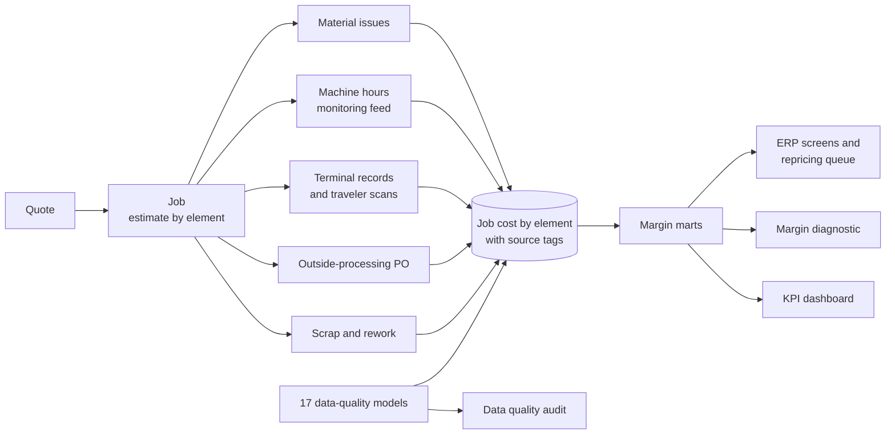

# ERP Job Costing & Margin Analytics

**An end-to-end data platform for a precision machining shop, spanning data engineering and analytics, applied to job costing and margin. It restructures the shop's ERP so every job carries its estimate and its measured actual cost by element, audits and repairs three years of history, and turns the connected job cost into a margin diagnostic, a KPI dashboard and a repricing queue.**

There is no machine learning model in this case, and deliberately so: the value is in connected, trustworthy job cost data and the comparison it enables. Once every job carries its estimate beside its measured actual, the shop's next step is a decision process (which parts to reprice, which setups to quote differently, which customer to bill for revision work), not a prediction.

The reporting layer's job cost screen, showing actual against estimate by cost element as transactions post, each element tagged measured or estimated with its source, and the job's coverage, is embedded in the shop's ERP as shown below:

[](https://brimsystems.github.io/mfg-job-costing/docs/index.html)

> **[Open the live job cost screen &rarr;](https://brimsystems.github.io/mfg-job-costing/docs/index.html)** &nbsp;·&nbsp; **[All four deliverables &rarr;](https://brimsystems.github.io/mfg-job-costing/)**

---

## Business Context

A precision machining shop (~$55M revenue, 210 employees) runs 28 CNC work centers plus sawing, deburr, inspection and assembly, with plating, heat treat, coating and grinding sent outside. About 65% of revenue is repeat contract parts on standing prices, 30% is new quoted work, and 5% is a small line of the shop's own standard components. Its ERP has quoting, routing, data collection and job costing modules, but only quoting was ever set up. Quotes converted to jobs without the estimate coming along; one blended shop rate covered everything from a manual drill press to a five-axis cell; operators clocked on and off at two terminals by the door; the machine-monitoring feed sat in the vendor's portal and was never joined to anything; outside-processing purchase orders were coded to a general ledger account with no job number; and repricing was an annual letter with one percentage. Nobody had ever run the ERP's job cost report, and the estimator had never seen a job's actuals.

The records this produced were wrong in two tiers. At the master and configuration level: no estimate on any job, routing standards set at first quote and never updated, one rate, stale material prices in the estimator's spreadsheet, standing prices that trailed material and rates, generic program numbers that broke the program-to-part mapping, and own-product standard costs fixed at launch. At the transaction level: clock records left open across shifts and overnight, setup and run never separated, time charged to adjacent jobs, one operator's record covering three machines, indirect time posted on whatever job was open, rework recorded as run, scrap thrown in the bin, and bar issued to the wrong job. These are the patterns commonly found in job-shop ERPs, and the engagement treats partial compliance as a design condition to measure and report rather than a defect to wish away: coverage rises through the rollout and plateaus, and the remainder is named.

Over twelve weeks the ERP was restructured (the estimate carries to the job on conversion, a job number is required on every outside-processing PO, rate pools replace the blended rate, terminals moved to the cells with setup, run, rework and indirect codes, the monitoring feed posts machine hours to jobs, scrap needs a reason), the history was repaired from the machine data with every correction logged and the unrepairable share stated, and a reporting layer was built on the connected records. This is the same kind of machining shop as the OEE case in [mfg-oee-maintenance](https://github.com/brimsystems/mfg-oee-maintenance), at a different size and with different data: a costing problem rather than an equipment one. Across 2025's jobs, 52% came in above the target margin, 37% below it and 10% lost money; the repricing review that followed repriced 257 repeat parts, held 72 and exited 30, recovering $667K a year of the $1.08M available; on jobs completed under the new process 98% of cost is measured from a transaction rather than a routing standard; and the clock records the door terminals produced carried 61% more hours than the machines ran.

---

## Deliverables

| # | Deliverable | What it is | Links |
|---|---|---|---|
| 1 | ERP job costing process | Four screens styled as the shop's ERP and its reporting layer, plus a one-page process document: **job creation** (the quote converted to a job with the estimate by element), **job in progress** (actual against estimate by element as transactions post, each element tagged measured or estimated with its source, running variance, coverage), **job close-out** (final variance, contribution, markup on cost and margin on price, the drivers in plain words, any estimated or unrepairable element), and the **repeat-part repricing queue** (every repeat part against current cost, what moved since the last quote, the gap to target on annual volume, and the decisions taken). | [Job in progress](https://brimsystems.github.io/mfg-job-costing/docs/index.html) · [Job creation](https://brimsystems.github.io/mfg-job-costing/docs/erp/job_creation.html) · [Close-out](https://brimsystems.github.io/mfg-job-costing/docs/erp/job_closeout.html) · [Repricing queue](https://brimsystems.github.io/mfg-job-costing/docs/erp/repricing_queue.html) · [Process document](https://brimsystems.github.io/mfg-job-costing/docs/erp/process.html) |
| 2 | ERP system data quality audit | Every type of error found across the ERP's twelve job costing tables and the machine-monitoring feed, the remediation of each with its evidence source and the rows repaired or flagged, the before-and-after measures, and the settings and process changes that keep job cost reliable. | [View](https://brimsystems.github.io/mfg-job-costing/docs/reports/data_quality_audit.html) |
| 3 | Margin analytics diagnostic | Where the shop's margin goes and why, from the corrected job cost: the 2025 margin distribution, the eight patterns found with the annual dollars behind each, customer and product profitability, the repricing list, estimate accuracy by element, and the recommended actions. Every figure carries the measured-versus-estimated share behind it. | [View](https://brimsystems.github.io/mfg-job-costing/docs/reports/margin_diagnostic.html) |
| 4 | KPI dashboard | The recurring weekly, monthly and trailing-twelve view: gross margin by job type, jobs below target, estimate accuracy by element, cost coverage measured versus estimated by work center, scan coverage, the repricing backlog, customer margin, outside-processing variance, and scrap and rework cost. | [View](https://brimsystems.github.io/mfg-job-costing/docs/reports/dashboard.html) |

---

## Code

### Data pipeline: [`data_pipeline/models/`](data_pipeline/models/)

| Layer | What it is, does and contains |
|---|---|
| Staging | One model per source table: the ERP's twelve job costing tables, the machine-monitoring feed, and the engagement's remediation records (program crosswalk, rate pools, attended ratios, estimate backfill, PO attribution, configuration change log, standard update log, repricing decisions). Each types the raw extract into a consistent shape. |
| Profiling | Fill rates of the fields job cost depends on before and after each configuration change, the shop's volume by month, and the job cost module assessment. |
| Data quality | One model per error in the audit, seventeen in all, each emitting the records affected with its evidence and, for the transaction errors, a confidence score. |
| Intermediate | The machine-hours-to-job assignment (program number to part through the crosswalk, part and date to the open job, split and flagged where several were open), the labor correction log with the rule that fired on every clock record, the estimate backfill, the outside-processing attribution, material corrected to the part's need, the current-cost recalculation of every repeat part, and weekly scan coverage. |
| Marts | Job cost by element and source in three versions (raw, as the ERP had it; cleaned, the history corrected; restructured, the engagement-period jobs under the new process) so coverage can be computed at any grain; margin by job, customer, part family, lot-size band, work center, material, estimator and month; the repricing queue; the coverage series; the labor correction summary; the audit's error register. |

### Analytics: [`analytics/`](analytics/)

| File | What it does |
|---|---|
| `src/export_marts.py` | Exports the dbt marts the deliverables read to parquet. |
| `src/flow.py` | The Prefect flow: dbt build, mart export, then the four deliverables, each a task. |
| `reports/generate_erp_screens.py` | The four ERP screens and the process document. |
| `reports/generate_data_quality_audit.py` | The data quality audit. |
| `reports/generate_margin_diagnostic.py` | The margin analytics diagnostic. |
| `reports/generate_dashboard.py` | The KPI dashboard. |

### Source data: [`data_source/generate/`](data_source/generate/)

| File | What it does |
|---|---|
| `generators/` | The masters (parts, routings, work centers and rate history, customers, vendors, material prices), the quotes and jobs, and the transactions: a scheduler that places every operation on a machine and an operator, then the labor, machine-monitoring, material, outside-processing and scrap records with the errors laid over them the way people make them. |
| `engagement.py` | The twelve weeks as the records they leave behind: interviews, the configuration gap list, the program crosswalk, rate pools, the estimate backfill, PO attribution, the configuration change log, the standard refresh with the estimator's review, and the repricing decisions. |
| `checks.py` | The realism checks the generated data is held to, written to `REALISM_CHECKS.md`. |

---

## How it works



Every transaction carries the job number, and job cost is built from the transactions rather than entered. A tested dbt pipeline stages the ERP extracts, the monitoring feed and the engagement's remediation records, flags the records affected by each of the seventeen errors, assigns machine hours to jobs through the program crosswalk, applies the labor corrections with the rule logged on every record, and assembles job cost by element with a source tag on each actual (machine, terminal, scan, issue, PO, standard fallback, unrepairable) in three versions: raw, cleaned and restructured. The margin marts and the current-cost recalculation of every repeat part feed the four deliverables, and a Prefect flow runs the build end to end.

---

## Data

The datasets were generated to represent typical records from a job-shop ERP and a machine-monitoring feed, with error types and rates constructed to reflect patterns commonly documented in these systems, so the full workflow can be demonstrated on data that is safe to share publicly. The [generators are in `data_source/generate/`](data_source/generate/).

---

## Running it locally

```bash
# 1. Environment
python3 -m venv .venv
source .venv/bin/activate          # Windows: .venv\Scripts\activate
pip install -e .

# 2. Generate the source data and run the realism checks
python3 -m data_source.generate.run_generator
python3 -m data_source.generate.checks

# 3. Warehouse: staging, profiling, data-quality models, intermediate models, marts and tests
cd data_pipeline && dbt build --profiles-dir . && cd ..
python3 -m analytics.src.export_marts

# 4. Client-facing deliverables
python3 -m analytics.reports.generate_erp_screens
python3 -m analytics.reports.generate_data_quality_audit
python3 -m analytics.reports.generate_margin_diagnostic
python3 -m analytics.reports.generate_dashboard

# Or steps 3 and 4 as one Prefect flow (add --generate to include step 2)
python3 -m analytics.src.flow
```

The report generators write standalone HTML to [`docs/`](docs/), which GitHub Pages serves.

---

## Stack

| Layer | Tools |
|---|---|
| Integration & transformation | dbt, DuckDB |
| Data quality & remediation | dbt data-quality models, Python, pandas |
| Orchestration | Prefect |
| Data generation | Python, pandas, NumPy |
| Reporting | matplotlib, HTML/CSS |
| Delivery | Static HTML, GitHub Pages |
