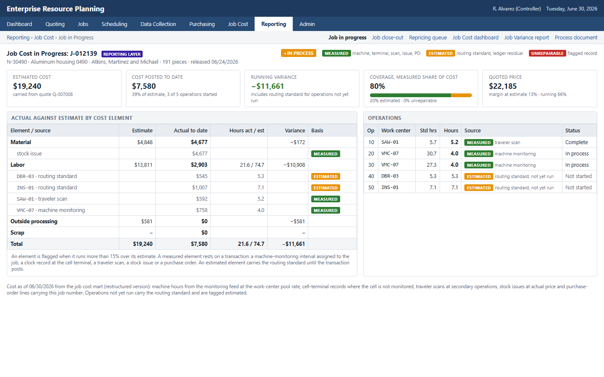
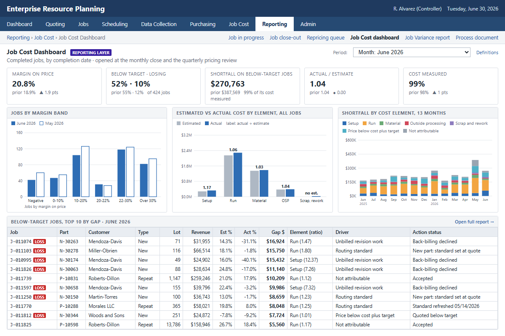
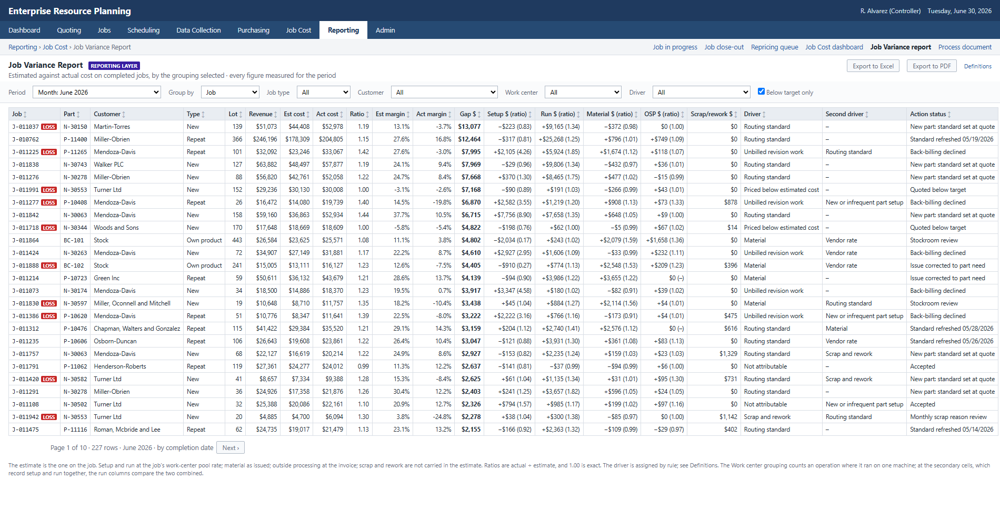
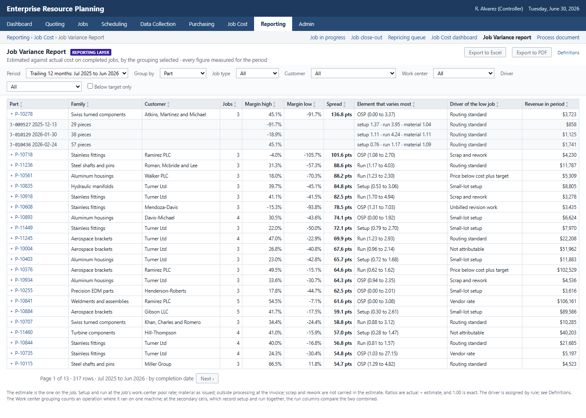
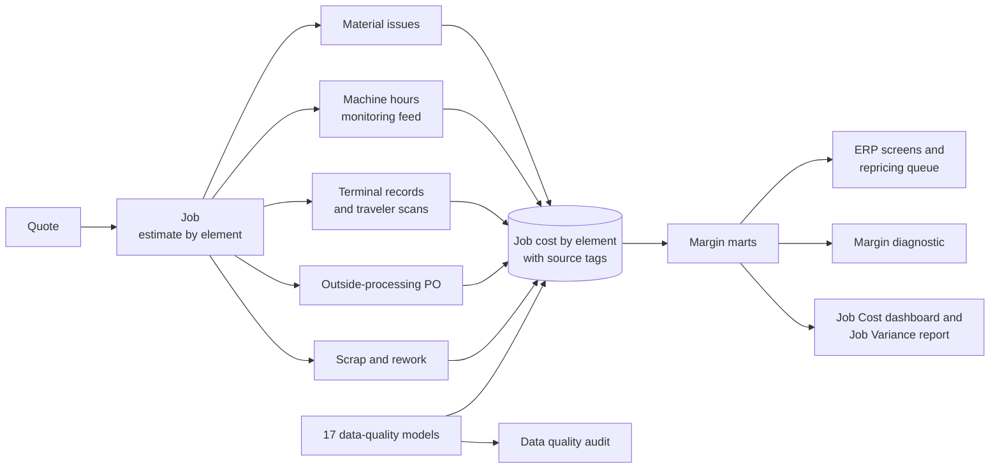

# ERP Job Costing & Margin Analytics

**An analytics-led engagement for a precision machining shop, applied to job costing and margin. The shop's ERP already held the job data; the work made the actuals trustworthy, connected the one source outside the ERP (machine monitoring) to jobs, added a monthly current-cost calculation for repeat parts, and read the result: the margin distribution across the shop's jobs, customer and product profitability, and a repricing list with the decisions taken on it.**

No larger platform was built because none was needed, and there is no machine learning model, deliberately: the value is in connected, trustworthy job cost data and the comparison it enables. Once every job carries its estimate beside its measured actual, the shop's next step is a decision process (which parts to reprice, which setups to quote differently, which customer to bill for revision work), not a prediction.

The reporting layer's job cost screen, showing actual against estimate by cost element as transactions post, each element tagged measured or estimated with its source, and the job's coverage, is embedded in the shop's ERP as shown below:

[](https://brimsystems.github.io/mfg-job-costing/docs/index.html)

> **[Open the live job cost screen &rarr;](https://brimsystems.github.io/mfg-job-costing/docs/index.html)** &nbsp;·&nbsp; **[All three deliverables &rarr;](https://brimsystems.github.io/mfg-job-costing/)**

The standing job cost views sit in the same reporting layer. The **Job Cost dashboard** is one screen, opened at the monthly close and the quarterly pricing review; the **Job Variance report** is one paginated report whose group-by parameter produces every detail view (job, part, cost element, work center, material, lot size, estimator, month), and the driver on each job is assigned by rule, with the rules shown on the screen. The screens represent the reporting layer's configuration, not a specific vendor's widget set.

[](https://brimsystems.github.io/mfg-job-costing/docs/erp/job_cost_dashboard.html)

[](https://brimsystems.github.io/mfg-job-costing/docs/erp/job_variance_report.html)

[](https://brimsystems.github.io/mfg-job-costing/docs/erp/job_variance_report.html?period=ttm&group=part&expand=first)

---

## Business Context

A precision machining shop (~$55M revenue, 210 employees) runs 28 CNC work centers plus sawing, deburr, inspection and assembly, with plating, heat treat, coating and grinding sent outside. About 65% of revenue is repeat contract parts on standing prices, 30% is new quoted work, and 5% is a small line of the shop's own standard components. Its ERP has quoting, routing, data collection and job costing modules, but only quoting was ever set up. Quotes converted to jobs without the estimate coming along; one blended shop rate covered everything from a manual drill press to a five-axis cell; operators clocked on and off at two terminals by the door; the machine-monitoring feed sat in the vendor's portal and was never joined to anything; outside-processing purchase orders were coded to a general ledger account with no job number; and repricing was an annual letter with one percentage. Nobody had ever run the ERP's job cost report, and the estimator had never seen a job's actuals.

The records this produced were wrong in two tiers. At the master and configuration level: no estimate on any job, routing standards set at first quote and never updated, one rate, stale material prices in the estimator's spreadsheet, standing prices that trailed material and rates, generic program numbers that broke the program-to-part mapping, and own-product standard costs fixed at launch. At the transaction level: clock records left open across shifts and overnight, setup and run never separated, time charged to adjacent jobs, one operator's record covering three machines, indirect time posted on whatever job was open, rework recorded as run, scrap thrown in the bin, bar issued to the wrong job, and three secondary cells where labor posting was never turned on at all. These are the patterns commonly found in job-shop ERPs, and the engagement treats partial compliance as a design condition to measure and report rather than a defect to wish away: coverage rises through the rollout and plateaus, and the remainder is named.

Over twelve weeks the ERP was reconfigured rather than replaced (the estimate carries to the job on conversion, a job number is required on every outside-processing PO, rate pools replace the blended rate, terminals moved to the cells with setup, run, rework and indirect codes, the monitoring feed posts machine hours to jobs, scrap needs a reason), the history was repaired from the machine data with every correction logged and the unrepairable share stated, and a thin reporting layer was built on the connected records. The data work stopped there; what the shop sees is the analysis. This is the same kind of machining shop as the OEE case in [mfg-oee-maintenance](https://github.com/brimsystems/mfg-oee-maintenance), at a different size and with different data: a costing problem rather than an equipment one. Across 2025's jobs, 45% came in above the target margin, 42% below it and 8% lost money. The jobs below target fell $2.21M short of target contribution, and the diagnostic splits that shortfall by cost element and by cause on the jobs themselves (revision work at one customer never billed and titanium and Inconel run hours are the two largest named causes) rather than projecting an opportunity. The repricing review repriced 158 repeat parts, held 56 with the reason recorded and exited 32, taking $151K a year of the $256K gap; on jobs completed under the new process 99% of cost is measured from a transaction rather than a routing standard.

---

## Deliverables

| # | Deliverable | What it is | Links |
|---|---|---|---|
| 1 | ERP job costing process | Five screens styled as the shop's ERP and its reporting layer, plus a one-page process document: **job in progress** (actual against estimate by element as transactions post, each element tagged measured or estimated with its source, running variance, coverage), **job close-out** (final variance, contribution, markup on cost and margin on price, the drivers in plain words, any estimated or unrepairable element), the **repeat-part repricing queue** (every repeat part against current cost, what moved since the last quote, the gap to target on annual volume, and the decisions taken), the **Job Cost dashboard** (one screen for the monthly close and the quarterly pricing review: margin, jobs below target and losing, the shortfall by element, estimate against actual by element, and the below-target jobs with the driver each rule assigns) and the **Job Variance report** (one paginated report whose group-by parameter produces every detail view: by job, part, cost element, work center, material, lot size, estimator and month). The screens represent the reporting layer's configuration, not a specific vendor's widget set. | [Job in progress](https://brimsystems.github.io/mfg-job-costing/docs/index.html) · [Close-out](https://brimsystems.github.io/mfg-job-costing/docs/erp/job_closeout.html) · [Repricing queue](https://brimsystems.github.io/mfg-job-costing/docs/erp/repricing_queue.html) · [Job Cost dashboard](https://brimsystems.github.io/mfg-job-costing/docs/erp/job_cost_dashboard.html) · [Job Variance report](https://brimsystems.github.io/mfg-job-costing/docs/erp/job_variance_report.html) · [Process document](https://brimsystems.github.io/mfg-job-costing/docs/erp/process.html) |
| 2 | Job costing ERP implementation and data quality audit | The changes made to the ERP to capture estimated and actual job cost by element, the data sources feeding the Jobs table, then the audit: every type of error found across the ERP's ten job costing tables, seventeen in all, the remediation of each with its evidence source and the rows repaired or flagged, the before-and-after measures, and the settings and process changes that keep job cost reliable. | [View](https://brimsystems.github.io/mfg-job-costing/docs/reports/data_quality_audit.html) |
| 3 | Margin analytics diagnostic | How margin is spread across the shop's jobs and why, from the corrected job cost: the 2025 margin distribution, actual margin against estimated margin, the overrun split by cost element and by cause, the same part's different outcomes, the jobs the in-progress flag would have caught, the loss-making jobs with an action each, customer profitability, repricing with the decisions taken, estimate accuracy by element, and the actions the owner took and declined. It attributes and does not project, and every dollar figure carries the measured share behind it. | [View](https://brimsystems.github.io/mfg-job-costing/docs/reports/margin_diagnostic.html) |

---

## Code

### Data pipeline: [`data_pipeline/models/`](data_pipeline/models/)

| Layer | What it is, does and contains |
|---|---|
| Staging | One model per source table: the ERP's ten job costing tables, the machine-monitoring feed, and the engagement's remediation records (program crosswalk, rate pools, attended ratios, estimate backfill, PO attribution, configuration change log, standard update log, repricing decisions, the actions the owner decided). Each types the raw extract into a consistent shape. |
| Profiling | Fill rates of the fields job cost depends on before and after each configuration change, the shop's volume by month, and the job cost module assessment. |
| Data quality | One model per error in the audit, seventeen in all (plus one listing the jobs released without an estimate), each emitting the records affected with its evidence and, for the transaction errors, a confidence score. |
| Intermediate | The machine-hours-to-job assignment (program number to part through the crosswalk, part and date to the open job, split and flagged where several were open), the labor correction log with the rule that fired on every clock record, the estimate backfill, the outside-processing attribution, material corrected to the part's need, the current-cost recalculation of every repeat part, and weekly scan coverage. |
| Marts | Job cost by element and source in three versions (raw, as the ERP had it; cleaned, the history corrected; restructured, the engagement-period jobs under the new process) so coverage can be computed at any grain; margin by job, customer, part family, lot-size band, work center, material, estimator and month; the repricing queue; each job's shortfall to target split by element and assigned to causes, with the action each cause maps to; the in-progress variance flag replayed over history; the within-part margin spread; the actions decided; the job variance mart (estimate against actual by element on every completed job, with the shortfall allocated by the reporting layer's rule), the driver model that assigns each job its driver by rule, and the period aggregates the Job Cost dashboard and Job Variance report read; the coverage series; the labor correction summary; the audit's error register. |

### Analytics: [`analytics/`](analytics/)

| File | What it does |
|---|---|
| `src/export_marts.py` | Exports the dbt marts the deliverables read to parquet. |
| `src/flow.py` | The Prefect flow: dbt build, mart export, then the deliverables, each a task. |
| `reports/generate_erp_screens.py` | The job in progress, close-out and repricing queue screens, and the process document. |
| `reports/generate_data_quality_audit.py` | The data quality audit. |
| `reports/generate_margin_diagnostic.py` | The margin analytics diagnostic. |
| `reports/generate_job_cost_reporting.py` | The Job Cost dashboard and the Job Variance report. |

### Source data: [`data_source/generate/`](data_source/generate/)

| File | What it does |
|---|---|
| `generators/` | The masters (parts, routings, work centers and rate history, customers, vendors, material prices), the quotes and jobs, and the transactions: a scheduler that places every operation on a machine and an operator, then the labor, machine-monitoring, material, outside-processing and scrap records with the errors laid over them the way people make them. |
| `engagement.py` | The twelve weeks as the records they leave behind: interviews, the configuration gap list, the program crosswalk, rate pools, the estimate backfill, PO attribution, the configuration change log, and the standard refresh with the estimator's review. |
| `repricing_review.py` | The repricing review: every repeat part below target on the pipeline's current cost, decided (repriced, held or exited) with the rationale. |
| `checks.py` | The realism checks the generated data is held to, written to `REALISM_CHECKS.md`. |

---

## How it works



Every transaction carries the job number, and job cost is built from the transactions rather than entered. A tested dbt pipeline stages the ERP extracts, the monitoring feed and the engagement's remediation records, flags the records affected by each of the seventeen errors, assigns machine hours to jobs through the program crosswalk, applies the labor corrections with the rule logged on every record, and assembles job cost by element with a source tag on each actual (machine, terminal, scan, issue, PO, standard fallback, unrepairable) in three versions: raw, cleaned and restructured. The margin marts and the current-cost recalculation of every repeat part feed the deliverables, and a Prefect flow runs the build end to end.

---

## Data

The datasets were generated to represent typical records from a job-shop ERP and a machine-monitoring feed, with error types and rates constructed to reflect patterns commonly documented in these systems, so the full workflow can be demonstrated on data that is safe to share publicly. The [generators are in `data_source/generate/`](data_source/generate/).

---

## Running it locally

```bash
# 1. Environment
python3 -m venv .venv
source .venv/bin/activate          # Windows: .venv\Scripts\activate
pip install -e .

# 2. Generate the source data
python3 -m data_source.generate.run_generator

# 3. Warehouse: staging, profiling, data-quality models, intermediate models, marts and tests.
#    The repricing review decides every part below target from the pipeline's own current cost,
#    so the queue is built after it.
cd data_pipeline && dbt build --profiles-dir . --exclude stg_remediation__repricing_decisions+ && cd ..
python3 -m data_source.generate.repricing_review
cd data_pipeline && dbt build --profiles-dir . --select stg_remediation__repricing_decisions+ && cd ..
python3 -m data_source.generate.checks
python3 -m analytics.src.export_marts

# 4. Client-facing deliverables
python3 -m analytics.reports.generate_erp_screens
python3 -m analytics.reports.generate_data_quality_audit
python3 -m analytics.reports.generate_margin_diagnostic
python3 -m analytics.reports.generate_job_cost_reporting

# Or steps 3 and 4 as one Prefect flow (add --generate to include step 2)
python3 -m analytics.src.flow
```

The report generators write standalone HTML to [`docs/`](docs/), which GitHub Pages serves.

---

## Stack

| Layer | Tools |
|---|---|
| Integration & transformation | dbt, DuckDB |
| Data quality & remediation | dbt data-quality models, Python, pandas |
| Orchestration | Prefect |
| Data generation | Python, pandas, NumPy |
| Reporting | matplotlib, HTML/CSS |
| Delivery | Static HTML, GitHub Pages |
