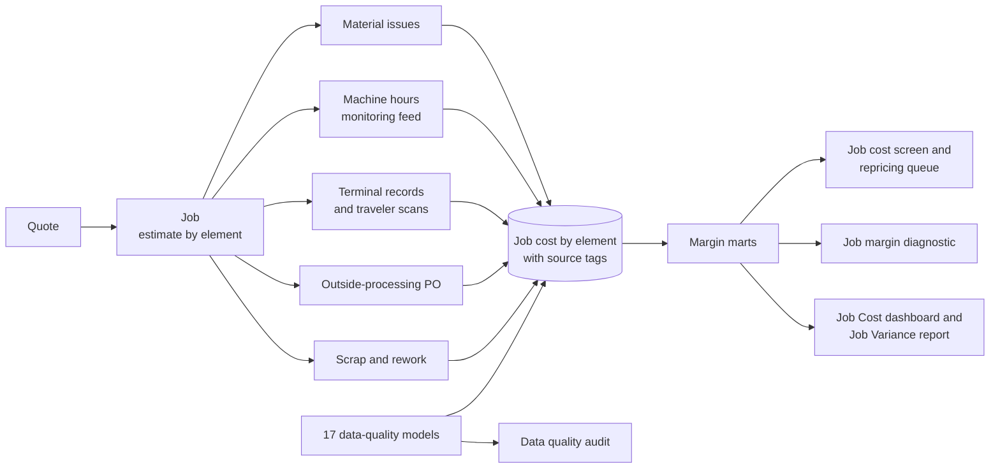

# ERP Job Costing & Margin Analytics

**Data engineering, an ERP job costing implementation and job margin analytics for a precision machining shop.**

**Comprehensive data cleaning** of the ERP's job costing records: inaccurate entries were corrected, stale standards, rates and prices were brought up to date, and missing estimates were backfilled. A **data pipeline** was then built that integrates quote, job, labor, machine, material, purchasing and scrap data from the ERP and the machine-monitoring feed into a single modeled job cost record, with every cost element tagged by its source. The pipeline is then **automated**, enabling a real-time view of job cost and margin detail in the ERP screens and reports.

**Job costing was implemented in the shop's ERP**. The ERP was reconfigured so that every job carries its estimate beside its measured actual, and four outputs were built in its reporting layer:

1. **Job cost screen**, in progress and completed: actual job costs against estimate by cost element, each element tagged measured or estimated, with the flag that is generated when a job's costs are predicted to run over 
2. **Job Cost dashboard**: the summary of completed jobs by period, including job margins vs. estimates and cost overruns
3. **Job Variance report**: the same jobs grouped by job, part, cost element, work center, material, lot size, estimator or month, with the driver on each job assigned by rule
   
The job costing ERP implementation and the data quality audit are documented in the **report on the job costing ERP implementation and data quality audit**.

An **analytics layer** was then built on the cleaned job cost record: the **job margin analytics diagnostic**, on how margin is spread across the shop's jobs and why, the drivers of cost overruns, the impact of the blended rate vs. work-center pool rates, and the jobs that lost money.

The **Job Cost Screen** shows actual costs against estimate by each element, for both current and completed jobs, and flags predicted cost overruns: 

[](https://brimsystems.github.io/mfg-data-engineering/job_costing/docs/index.html)

The **Job Cost dashboard** is the summary of completed jobs by period, including an overview of job margins and cost overruns, and the top 10 jobs with the largest margin miss vs. estimates.  

[](https://brimsystems.github.io/mfg-data-engineering/job_costing/docs/erp/job_cost_dashboard.html)

The **Job Variance report** groups the same jobs (by job, part, cost element, work center, material, lot size, estimator or month), and the driver behind each job's margin miss vs. estimates.

[](https://brimsystems.github.io/mfg-data-engineering/job_costing/docs/erp/job_variance_report.html)

> **[Open the live job cost screen &rarr;](https://brimsystems.github.io/mfg-data-engineering/job_costing/docs/index.html)** &nbsp;·&nbsp; **[All the deliverables &rarr;](https://brimsystems.github.io/mfg-data-engineering/job_costing/)**
---

## Business Context

A precision machining shop of about $56M revenue and 210 employees ran 28 CNC work centers plus sawing, deburr, inspection and assembly, with plating, heat treat, coating and grinding sent outside. About 67% of revenue was repeat contract parts on standing prices, 28% new quoted work and 5% a small line of its own standard components. On the jobs released in 2025 it earned a 25.4% margin against the 28.8% its estimates had promised, and it had one margin figure for the year with nothing beneath it: it could not say which jobs, parts or customers made money, whether a standing price set three years earlier still covered the part, or whether a job running on the floor was already over its estimate.

The ERP it already owned had quoting, routing, data collection and job costing modules, and only quoting had ever been set up. Quotes converted to jobs without the estimate coming along. One blended shop rate costed a manual drill press and a five-axis cell alike. Operators clocked on and off at two terminals by the door, so clock records ran across breaks and shifts, setup and run were never separated, time landed on adjacent job numbers and one record covered three machines. The machine-monitoring feed sat in the vendor's portal and was never joined to a job. Outside-processing purchase orders were coded to a ledger account with no job number on 72% of lines. Repricing was an annual letter with one percentage. The audit found seventeen types of error across the ERP's ten job costing tables. Rather than buy a new system, the shop chose to configure the one it had and repair its history.

Over twelve weeks the ERP was reconfigured: the estimate carries to the job on conversion, rate pools by work center replace the blended rate, terminals moved to the cells with setup, run, rework and indirect codes, the monitoring feed posts machine hours to jobs, a job number is required on every outside-processing purchase order, and scrap needs a reason. The three-year history was repaired from the machine data with every correction logged and the unrepairable share stated, and a monthly current-cost calculation was added for every repeat part. On the jobs completed under the new process 99% of cost is measured from a transaction. The margin diagnostic on the corrected record found the overrun broad rather than concentrated ($3.49M over estimate on some jobs and elements, $2.63M under on others, $852K net), showed that the blended rate had overstated the margin on the shop's 5-axis work by $902K of cost across two families, and replayed the new in-progress flag over the year: 494 jobs would have been caught with time to act, and $308K of their overrun came after the flag. The repricing review put all 262 repeat parts priced below current cost plus the target markup to a decision, 170 repriced for $115K a year, 45 held with a reason recorded and 47 exited.

---

## Deliverables

The four ERP outputs, then the two reports.

| # | Deliverable | What it is | Links |
|---|---|---|---|
| 1 | Job cost screen | One screen in two states. **In progress**: actual against estimate by element as transactions post, each element tagged measured or estimated with its source, the estimate to date, the variance on completed work, the in-progress flag and the projected cost at completion. **Completed**: the same layout with the final variance, what drove it in plain words, and any estimated or unrepairable element. | [In progress](https://brimsystems.github.io/mfg-data-engineering/job_costing/docs/index.html) · [Completed](https://brimsystems.github.io/mfg-data-engineering/job_costing/docs/erp/job_closeout.html) |
| 2 | Job Cost dashboard | The summary of completed jobs by period, for the monthly close and the quarterly pricing review: margin, jobs below estimate and losing, the shortfall by element, estimate against actual by element, and the below-estimate jobs with the driver each rule assigns. | [View](https://brimsystems.github.io/mfg-data-engineering/job_costing/docs/erp/job_cost_dashboard.html) |
| 3 | Job Variance report | One paginated report that groups the same jobs by job, part, cost element, work center, material, lot size, estimator and month. | [View](https://brimsystems.github.io/mfg-data-engineering/job_costing/docs/erp/job_variance_report.html) |
| 4 | Report: job costing ERP implementation and data quality audit | The changes made to the ERP to capture estimated and actual job cost by element, the data sources feeding the Jobs table, then the audit: every type of error found across the ERP's job costing tables, seventeen in all, the error remediation process, and the before-and-after results. | [View](https://brimsystems.github.io/mfg-data-engineering/job_costing/docs/reports/data_quality_audit.html) |
| 5 | Analytics diagnostic report: job costing & margin | How margin is spread across the shop's jobs and why, from the corrected job cost: the 2025 margin overview, actual cost against estimate by element, blended rate vs. work-center pool rates, and the jobs that lost money with an action each. | [View](https://brimsystems.github.io/mfg-data-engineering/job_costing/docs/reports/margin_diagnostic.html) |

---

## Code

### Data pipeline: [`data_pipeline/models/`](data_pipeline/models/)

| Layer | What it is, does and contains |
|---|---|
| Staging | One model per source table: the ERP's job costing tables and its vendor record, the machine-monitoring feed, and the engagement's remediation records (program crosswalk, rate pools, attended ratios, estimate backfill, PO attribution, configuration change log, standard update log, repricing decisions, the actions the owner decided). Each types the raw extract into a consistent shape. |
| Profiling | Fill rates of the fields job cost depends on before and after each configuration change, the shop's volume by month, and the job cost module assessment. |
| Data quality | One model per error in the audit, named by the error it tests, seventeen in all (plus one listing the jobs released without an estimate), each emitting the records affected with its evidence and, for the transaction errors, a confidence score. |
| Intermediate | The machine-hours-to-job assignment (program number to part through the crosswalk, part and date to the open job, split and flagged where several were open), the labor correction log with the rule that fired on every clock record, the estimate backfill, the outside-processing attribution with its quantity guard and the vendor-minimum flag, revision work on every job, second setups read from the machine feed, the in-progress flag at three thresholds, material corrected to the part's need, the current-cost recalculation of every repeat part, and weekly scan coverage. |
| Marts | Job cost by element and source in three versions (raw, as the ERP had it; cleaned, the history corrected; restructured, the engagement-period jobs under the new process) so coverage can be computed at any grain; margin by job, customer, part family, lot-size band, work center, material, estimator and month; the repricing queue; each job's shortfall to target split by element and assigned to causes, with the action each cause maps to; the in-progress variance flag replayed over history, with the overrun after the flag, and the same replay at three thresholds (`mart_inprogress_threshold_replay`); margin by part family at the blended rate and at the pool rates (`mart_margin_by_family_rate_basis`); the setup charge on repeat releases below half the quoted lot (`mart_release_setup_charge`); the within-part margin spread; the actions decided; the job variance mart (estimate against actual by element on every completed job, with the shortfall allocated by the reporting layer's rule), the driver model that assigns each job its driver by rule, and the period aggregates the Job Cost dashboard and Job Variance report read; the coverage series; the labor correction summary; the audit's error register. |

### Analytics: [`analytics/`](analytics/)

| File | What it does |
|---|---|
| `src/export_marts.py` | Exports the dbt marts the deliverables read to parquet. |
| `src/flow.py` | The Prefect flow: dbt build, mart export, then the deliverables, each a task. |
| `reports/generate_erp_screens.py` | The job cost screen in its two states and the repricing queue. |
| `reports/generate_data_quality_audit.py` | The data quality audit, with the ERP table detail (Appendix A) and the job costing process as issued to the shop (Appendix B). |
| `reports/generate_margin_diagnostic.py` | The job margin analytics diagnostic. |
| `reports/generate_job_cost_reporting.py` | The Job Cost dashboard and the Job Variance report. |
| `reports/capture_screenshots.py` | The four screenshots under `docs/screenshots/`. |

### Source data: [`data_source/generate/`](data_source/generate/)

| File | What it does |
|---|---|
| `generators/` | The masters (parts, routings, work centers and rate history, customers, vendors, material prices), the quotes and jobs, and the transactions: a scheduler that places every operation on a machine and an operator, then the labor, machine-monitoring, material, outside-processing and scrap records with the errors laid over them the way people make them. Each job draws from its own random stream, so a change to one job leaves the others' records as they were. |
| `engagement.py` | The twelve weeks as the records they leave behind: interviews, the configuration gap list, the program crosswalk, rate pools, the estimate backfill, PO attribution, the configuration change log, and the standard refresh with the estimator's review. |
| `repricing_review.py` | The repricing review: every repeat part below target on the pipeline's current cost, decided (repriced, held or exited) with the rationale. |
| `checks.py` | The realism checks the source extracts and the marts are held to, written to `REALISM_CHECKS.md`. |

---

## How it works



Every transaction carries the job number, and job cost is built from the transactions rather than entered. A tested dbt pipeline stages the ERP extracts, the monitoring feed and the engagement's remediation records, flags the records affected by each of the seventeen errors, assigns machine hours to jobs through the program crosswalk, applies the labor corrections with the rule logged on every record, and assembles job cost by element with a source tag on each actual (machine, terminal, scan, issue, PO, standard fallback, unrepairable) in three versions: raw, cleaned and restructured. The margin marts and the current-cost recalculation of every repeat part feed the deliverables, and a Prefect flow runs the build end to end.

---

## Data

The datasets were generated to represent typical records from a job-shop ERP and a machine-monitoring feed, with error types and rates set to reflect what is commonly documented in these systems, so the full workflow can be shown on data that is safe to share publicly. The [generators are in `data_source/generate/`](data_source/generate/).

---

## Running it locally

```bash
# 1. Environment
python3 -m venv .venv
source .venv/bin/activate          # Windows: .venv\Scripts\activate
pip install -e .                   # add ".[dev]" for the screenshots

# 2. Generate the source data
python3 -m data_source.generate.run_generator

# 3. Warehouse: staging, profiling, data-quality models, intermediate models, marts and tests.
#    The repricing review decides every part below target from the pipeline's own current cost,
#    so the queue is built after it.
cd data_pipeline && dbt build --profiles-dir . --exclude stg_remediation__repricing_decisions+ && cd ..
python3 -m data_source.generate.repricing_review
cd data_pipeline && dbt build --profiles-dir . --select stg_remediation__repricing_decisions+ && cd ..
python3 -m analytics.src.export_marts
python3 -m data_source.generate.checks

# 4. Client-facing deliverables
python3 -m analytics.reports.generate_erp_screens
python3 -m analytics.reports.generate_data_quality_audit
python3 -m analytics.reports.generate_margin_diagnostic
python3 -m analytics.reports.generate_job_cost_reporting
python3 analytics/reports/capture_screenshots.py     # optional: the README screenshots

# Or steps 3 and 4 as one Prefect flow (add --generate to include step 2)
python3 -m analytics.src.flow
```

The report generators write standalone HTML to [`docs/`](docs/), which GitHub Pages serves.

---

## Stack

| Layer | Tools |
|---|---|
| Integration & transformation | dbt, DuckDB |
| Data quality & remediation | dbt data-quality models, Python, pandas |
| Orchestration | Prefect |
| Data generation | Python, pandas, NumPy |
| Reporting | matplotlib, HTML/CSS |
| Delivery | Static HTML, GitHub Pages |
