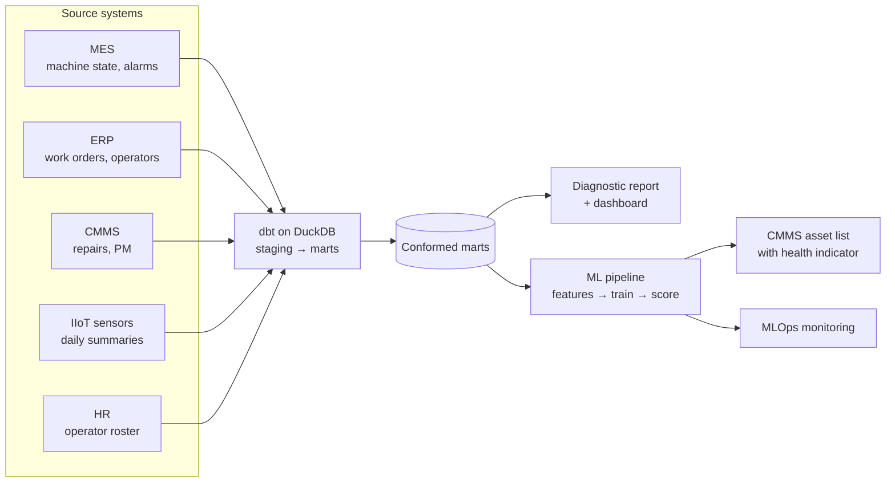

# OEE & Machine Health

**Data engineering, analytics and machine learning for a precision machining shop, applied to OEE, downtime and machine health.**

The work began with **comprehensive data cleaning** of all five source systems (MES, ERP, CMMS, IIoT sensors, HR): fields were typed and standardized, the operator identifier that differed between systems was reconciled, and PMs logged without a scheduled date were flagged.

A **data pipeline** was then built that integrates machine, order, maintenance, sensor and operator data from the five disconnected systems into a single modeled dataset.

The pipeline is then **automated**: a monthly flow stages and tests each extract, rebuilds the marts the reports, dashboard and model read, rescores the model and runs its monitoring.

An **analytics and ML layer** is built on the cleaned and integrated data:

1. **Analytics diagnostic report** on where OEE is lost, what drives unplanned downtime and what it costs
2. **KPI dashboard** tracking OEE, downtime and reliability (MTBF, MTTR) by machine, day and month
3. **Machine health indicator** that rates every machine daily as CRITICAL, ELEVATED or OK by how soon it is likely to need an unplanned repair, from the joined alarm, downtime, maintenance, failure-history and sensor record, and ranks the fleet in the CMMS. Supported by technical documentation and monitoring in production

The health indicator is embedded in the shop's CMMS asset list:

[](https://brimsystems.github.io/mfg-data-engineering/oee_downtime/docs/index.html)

> **[Open the CMMS asset list →](https://brimsystems.github.io/mfg-data-engineering/oee_downtime/docs/index.html)** · **[All six deliverables →](https://brimsystems.github.io/mfg-data-engineering/oee_downtime/)**

---

## Business Context

A precision machining shop (~$40M revenue) ran twelve CNC machines in three cells. From January 2023 to March 2026, the shop's OEE averaged 64.3%, below its target of 85%. It knew the gap was there but had little on where it came from: OEE was not broken into its components by machine, downtime was tallied after the fact with no cost attached, and maintenance ran on a fixed calendar.

With its current data collection infrastructure, the shop wasn't able to get more information on the root causes of its OEE gap and its unplanned downtime. Data was spread across five disconnected systems: MES, ERP, CMMS, IIoT sensors and HR. The systems shared little beyond a machine id and carried operators under different identifiers, and none of them were connected, so data pulls were manual, and higher level analysis wasn't possible.

As a result of this project, the data was cleaned, integrated and automated, producing a central data repository off of which a diagnostic analysis was completed and a machine health indicator was built. The diagnostic report details where OEE is lost, what drives unplanned downtime and what it costs. The health indicator rates every machine daily by how soon it is likely to need an unplanned repair.

---

## Deliverables

| # | Deliverable | What it is | Links |
|---|---|---|---|
| 1 | CMMS asset list with the health indicator | The machine health indicator embedded in the shop's CMMS: each machine's health indicator, the drivers behind it, its PM status and current OEE, ranked by urgency. | [View](https://brimsystems.github.io/mfg-data-engineering/oee_downtime/docs/index.html) |
| 2 | Analytics diagnostic report | Where OEE is lost across availability and performance, the downtime Pareto and its cost, PM compliance, and the cross-system findings on alarms, PM status and operator setup. | [View](https://brimsystems.github.io/mfg-data-engineering/oee_downtime/docs/reports/analytics_report.html) |
| 3 | KPI dashboard | The recurring daily and monthly view of OEE, downtime, MTBF and MTTR by machine, with trends. | [View](https://brimsystems.github.io/mfg-data-engineering/oee_downtime/docs/reports/dashboard.html) |
| 4 | Health indicator overview & performance report | What the indicator rates, how it performed against the calendar PM schedule, a rules baseline and a repair-interval baseline, the warning it gave before failures, and its limits. | [View](https://brimsystems.github.io/mfg-data-engineering/oee_downtime/docs/reports/model_overview.html) |
| 5 | ML technical report | Feature construction from the marts, the two target windows, the time-based split, model selection and tuning, calibration, thresholds, and the baseline comparison. | [View](https://brimsystems.github.io/mfg-data-engineering/oee_downtime/docs/reports/technical_report.html) |
| 6 | MLOps monitoring report | Monthly monitoring on performance, target, prediction and feature drift with a rules-based retraining decision. | [View](https://brimsystems.github.io/mfg-data-engineering/oee_downtime/docs/reports/monitoring_report.html) |

---

## Code

### Data pipeline: [`data_pipeline/models/`](data_pipeline/models/)

| Layer | What it is, does and contains |
|---|---|
| Staging | One model per source table (MES, ERP, CMMS, IIoT sensors, HR). Each cleans the raw extract into a consistent shape: types, units, timestamps, and the identifier each system uses. |
| Intermediate | Conforms the staged tables: shared machine, operator and shift dimensions (the HR employee number mapped to the ERP payroll number and the MES operator id), a time series of machine states, and a maintenance and failure event history with PM compliance flags. |
| Marts | Analysis-ready tables the reports, dashboard and model read: OEE with its components by machine, day and month; the downtime Pareto with cost; PM compliance; operator setup; and the machine health feature table with its rolling features and the 7- and 21-day targets. |

### Machine health indicator: [`ml/src/`](ml/src/)

| File | What it does |
|---|---|
| `features.py` | Reads the feature mart (one row per machine, day and shift), adds the interaction flags, fills early gaps and declares the features and targets. |
| `training.py` | Trains, tunes and calibrates the candidate classifiers for each window, compares them with the calendar PM, rules and interval baselines, selects and registers the best. |
| `scoring.py` | Runs monthly batch scoring: the health indicator and its drivers for every machine and day. |
| `monitoring.py` | Performance, target, prediction and feature drift against reference windows, with the retraining rule. |

---

## How it works



Raw extracts from the five systems are staged, tested and conformed by a dbt pipeline into marts. The marts feed the diagnostic report and dashboard and the ML pipeline. The feature table is split by time into training, validation and test sets; candidate classifiers for each window are tuned, calibrated and compared with three baselines, and the best is registered. Scoring runs as a monthly batch inside the flow, and each period is monitored against training and validation references.

The monthly flow is defined in [`pipeline_flow.py`](pipeline_flow.py), with its schedule (first business day of the month, 06:00); training is run by hand when the monitoring verdict calls for it.

---

## Data

The datasets were generated to represent typical records from the source systems involved (MES, IIoT sensors, CMMS, ERP, and HR), so the full workflow can be demonstrated on data that is safe to share publicly; the [generators are in `data_source/generate/`](data_source/generate/).

---

## Running it locally

```bash
# 1. Environment
python3 -m venv .venv
source .venv/bin/activate          # Windows: .venv\Scripts\activate
pip install -e .                   # project + dependencies from pyproject.toml

# 2. Generate data and build the warehouse
python3 -m data_source.generate.run_generator
cd data_pipeline && dbt build && cd ..

# 3. Analytics (diagnostic report + dashboard)
cd analytics/reports && python3 generate_analytics_report.py && cd ../..
cd analytics/dashboard && python3 generate_dashboard.py && cd ../..

# 4. ML lifecycle (train -> score -> monitor)
cd ml
python3 src/training.py            # trains, calibrates, selects and registers the health indicator
python3 src/ablation.py            # 7-day model without the sensor features (evaluation table only)
python3 src/scoring.py             # monthly batch scoring with SHAP drivers
python3 src/monitoring.py          # four-layer drift and performance monitoring
cd ..

# 5. Client-facing report generators
cd ml/reports
python3 generate_cmms_dashboard.py
python3 capture_cmms_screenshot.py # optional: needs pip install -e ".[dev]"
python3 generate_model_overview.py
python3 generate_ml_technical.py
python3 generate_monitoring_report.py
cd ../..

# 6. The monthly flow: dbt build, the analytics generators, scoring, monitoring and
#    the four ML report generators in one run (training stays manual, step 4)
python3 pipeline_flow.py
```

The report generators write standalone HTML; the copies served by GitHub Pages live under [`docs/`](docs/).

---

## Stack

| Layer | Tools |
|---|---|
| Integration & transformation | dbt, DuckDB |
| Analytics & reporting | Python, pandas, matplotlib, seaborn, HTML/CSS |
| Modeling | XGBoost, scikit-learn, Optuna, SHAP |
| MLOps | MLflow (tracking & registry), Evidently (drift), Prefect (orchestration) |
| Delivery | Static HTML, GitHub Pages |

---

Brian Davis. Data engineering and applied analytics/ML for manufacturers. Other work: [github.com/brimsystems](https://github.com/brimsystems?tab=repositories).
