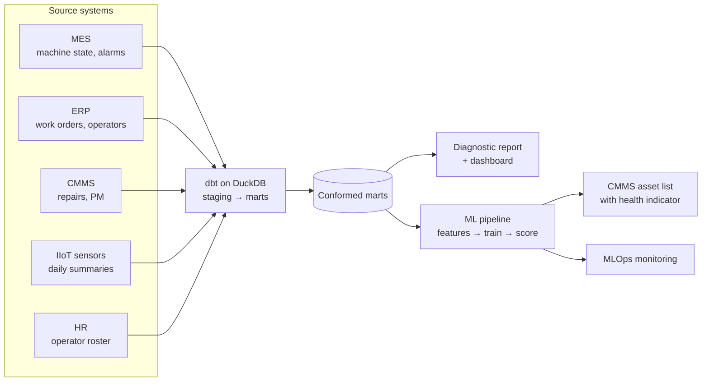

# Manufacturing Data Platform: OEE & Machine Health

**An end-to-end data platform for a precision machining shop, spanning data engineering, analytics and machine learning, applied to OEE, downtime and machine health.**

Five systems that recorded the floor independently, with operator ids that differed between HR and the ERP, 15-minute machine states against job records that carry only start and end times, and PM dates split between scheduled and completed, were cleaned, reconciled and joined into one modeled record. On that record the shop measured OEE at 64.3% against an 85% target, traced 76% of unplanned downtime hours to tooling and mechanical failures, found its three oldest machines at 55% OEE against 67% for the rest, and found two patterns no single system could show: alarm rates 2.4x higher while a PM is overdue, and three operators setting up at 1.3x the median. Six actions worth about $566K a year in contribution margin came out of it, against $1.5M a year at the 85% target.

The pipeline is automated rather than a one-time pull: a monthly flow stages and tests each extract, rebuilds the marts the reports, dashboard and model read, rescores the model and runs its monitoring, so every figure rebuilds from the source extracts with the same commands.

It starts with a **data pipeline** that integrates machine, order, maintenance, sensor and operator data from five disconnected systems into a single modeled dataset:

- **MES** (machine monitoring): machine state every 15 minutes (running, idle, setup, alarm, planned or unplanned down) with duration, shift, operator, spindle utilization and alarm code; the machine master with type, controller, cell, age and install date.
- **ERP**: work orders with machine, operator payroll number, part, customer, scheduled and actual start, end and hours, setup hours, status and material.
- **CMMS**: maintenance events with type (unplanned repair, PM, inspection), failure code, open and close times, downtime hours, technician, parts, resolution notes, PM scheduled and completed dates and days overdue.
- **IIoT sensors**: one daily summary per machine of vibration RMS, bearing temperature, spindle power and hydraulic pressure.
- **HR**: the operator roster with employee number, shift, role, hire date and certification.

The joins are what turn five reports into one. The MES knows alarms but not PM due dates, so the alarm-rate-while-overdue finding needs the CMMS; the ERP knows setup hours by payroll number and only HR knows which operator that is; MTBF divides MES running hours by the count of unplanned repairs in the CMMS, where the failure code is recorded; the downtime cost joins CMMS hours to the MES machine type for the rate. Six findings rest on a cross-system join (five in the diagnostic report, MTBF on the dashboard) and the rest come from the MES alone.

An **analytics and ML layer** is then built on the integrated record:

1. **Analytics diagnostic report** on where OEE is lost, what drives unplanned downtime and what it costs
2. **KPI dashboard** tracking OEE, downtime and reliability (MTBF, MTTR) by machine, day and month
3. **Machine health indicator** that rates every machine daily as CRITICAL, ELEVATED or OK by how soon it is likely to need an unplanned repair, from the joined alarm, downtime, maintenance, failure-history and sensor record, and ranks the fleet in the CMMS. Supported by technical documentation and monitoring in production

The health indicator is embedded in the shop's CMMS asset list:

[](https://brimsystems.github.io/mfg-data-engineering/oee_downtime/docs/index.html)

> **[Open the CMMS asset list →](https://brimsystems.github.io/mfg-data-engineering/oee_downtime/docs/index.html)** · **[All six deliverables →](https://brimsystems.github.io/mfg-data-engineering/oee_downtime/)**

---

## Business Context

A precision machining shop of about $40M revenue ran twelve CNC machines in three cells. Five systems recorded the floor and shared little beyond a machine id. The MES logged machine state every 15 minutes. The ERP and MES carried operators under payroll numbers. The CMMS held maintenance and PM history by asset, with the scheduled date in one field and the completed date in another. HR kept the operator roster under its own identifier. Condition-monitoring sensors wrote one summary reading per machine per day. Questions that crossed systems were answered by hand from extracts, when they were answered at all, and the answer could not be repeated the next month.

The shop's reporting showed it. OEE was not broken into its components by machine. Downtime was tallied after the fact from the CMMS without the machine state around it or a cost attached. Maintenance ran on a fixed calendar, and the effect of late PMs had not been measured because the alarm record and the PM record sat in different systems. The causes and cost of the shop's downtime, the effect of late PMs on alarm rates, and the setup time that belongs to each operator were all in the records and none of them was in a report.

The engagement built a tested pipeline that cleans each system's extract, reconciles the identifiers, and joins the five into one modeled record, rebuilt by a monthly flow. On that record the shop has OEE with its components by machine, the causes and cost of its unplanned downtime, the two findings that only the joined record could produce, and a daily machine health indicator that ranks the fleet by how soon each machine is likely to need a repair. The actions in the diagnostic report are costed from the same record.

---

## Deliverables

| # | Deliverable | What it is | Links |
|---|---|---|---|
| 1 | CMMS asset list with the health indicator | The machine health indicator embedded in the shop's CMMS: each machine's health indicator, the drivers behind it, its PM status and current OEE, ranked by urgency. | [View](https://brimsystems.github.io/mfg-data-engineering/oee_downtime/docs/index.html) |
| 2 | Analytics diagnostic report | Where OEE is lost across availability and performance, the downtime Pareto and its cost, PM compliance, and the cross-system findings on alarms, PM status and operator setup. | [View](https://brimsystems.github.io/mfg-data-engineering/oee_downtime/docs/reports/analytics_report.html) |
| 3 | KPI dashboard | The recurring daily and monthly view of OEE, downtime, MTBF and MTTR by machine, with trends. | [View](https://brimsystems.github.io/mfg-data-engineering/oee_downtime/docs/reports/dashboard.html) |
| 4 | Health indicator overview & performance report | What the indicator rates, how it performed against the calendar PM schedule, a rules baseline and a repair-interval baseline, the warning it gave before failures, and its limits. | [View](https://brimsystems.github.io/mfg-data-engineering/oee_downtime/docs/reports/model_overview.html) |
| 5 | ML technical report | Feature construction from the marts, the two target windows, the time-based split, model selection and tuning, calibration, thresholds, and the baseline comparison. | [View](https://brimsystems.github.io/mfg-data-engineering/oee_downtime/docs/reports/technical_report.html) |
| 6 | MLOps monitoring report | Monthly monitoring on performance, target, prediction and feature drift with a rules-based retraining decision. | [View](https://brimsystems.github.io/mfg-data-engineering/oee_downtime/docs/reports/monitoring_report.html) |

---

## Code

### Data pipeline: [`data_pipeline/models/`](data_pipeline/models/)

| Layer | What it is, does and contains |
|---|---|
| Staging | One model per source table (MES, ERP, CMMS, IIoT sensors, HR). Each cleans the raw extract into a consistent shape: types, units, timestamps, and the identifier each system uses. |
| Intermediate | Conforms the staged tables: shared machine, operator and shift dimensions (the HR employee number mapped to the ERP payroll number and the MES operator id), a time series of machine states, and a maintenance and failure event history with PM compliance flags. |
| Marts | Analysis-ready tables the reports, dashboard and model read: OEE with its components by machine, day and month; the downtime Pareto with cost; PM compliance; operator setup; and the machine health feature table with its rolling features and the 7- and 21-day targets. |

### Machine health indicator: [`ml/src/`](ml/src/)

| File | What it does |
|---|---|
| `features.py` | Reads the feature mart (one row per machine, day and shift), adds the interaction flags, fills early gaps and declares the features and targets. |
| `training.py` | Trains, tunes and calibrates the candidate classifiers for each window, compares them with the calendar PM, rules and interval baselines, selects and registers the best. |
| `scoring.py` | Runs monthly batch scoring: the health indicator and its drivers for every machine and day. |
| `monitoring.py` | Performance, target, prediction and feature drift against reference windows, with the retraining rule. |

---

## How it works



Raw extracts from the five systems are staged, tested and conformed by a dbt pipeline into marts. The marts feed the diagnostic report and dashboard and the ML pipeline. The feature table is split by time into training, validation and test sets; candidate classifiers for each window are tuned, calibrated and compared with three baselines, and the best is registered. Scoring runs as a monthly batch inside the flow, and each period is monitored against training and validation references.

The monthly flow is defined in [`pipeline_flow.py`](pipeline_flow.py), with its schedule (first business day of the month, 06:00); training is run by hand when the monitoring verdict calls for it.

---

## Data

The datasets were generated to represent typical records from the source systems involved (MES, IIoT sensors, CMMS, ERP, and HR), so the full workflow can be demonstrated on data that is safe to share publicly; the [generators are in `data_source/generate/`](data_source/generate/).

---

## Running it locally

```bash
# 1. Environment
python3 -m venv .venv
source .venv/bin/activate          # Windows: .venv\Scripts\activate
pip install -e .                   # project + dependencies from pyproject.toml

# 2. Generate data and build the warehouse
python3 -m data_source.generate.run_generator
cd data_pipeline && dbt build && cd ..

# 3. Analytics (diagnostic report + dashboard)
cd analytics/reports && python3 generate_analytics_report.py && cd ../..
cd analytics/dashboard && python3 generate_dashboard.py && cd ../..

# 4. ML lifecycle (train -> score -> monitor)
cd ml
python3 src/training.py            # trains, calibrates, selects and registers the health indicator
python3 src/ablation.py            # 7-day model without the sensor features (evaluation table only)
python3 src/scoring.py             # monthly batch scoring with SHAP drivers
python3 src/monitoring.py          # four-layer drift and performance monitoring
cd ..

# 5. Client-facing report generators
cd ml/reports
python3 generate_cmms_dashboard.py
python3 capture_cmms_screenshot.py # optional: needs pip install -e ".[dev]"
python3 generate_model_overview.py
python3 generate_ml_technical.py
python3 generate_monitoring_report.py
cd ../..

# 6. The monthly flow: dbt build, the analytics generators, scoring, monitoring and
#    the four ML report generators in one run (training stays manual, step 4)
python3 pipeline_flow.py
```

The report generators write standalone HTML; the copies served by GitHub Pages live under [`docs/`](docs/).

---

## Stack

| Layer | Tools |
|---|---|
| Integration & transformation | dbt, DuckDB |
| Analytics & reporting | Python, pandas, matplotlib, seaborn, HTML/CSS |
| Modeling | XGBoost, scikit-learn, Optuna, SHAP |
| MLOps | MLflow (tracking & registry), Evidently (drift), Prefect (orchestration) |
| Delivery | Static HTML, GitHub Pages |

---

Brian Davis. Data engineering and applied analytics/ML for manufacturers. Other work: [github.com/brimsystems](https://github.com/brimsystems?tab=repositories).
