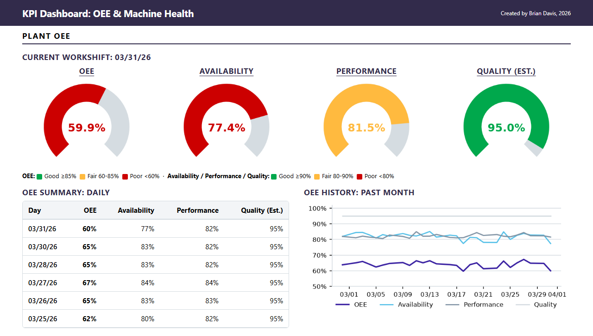
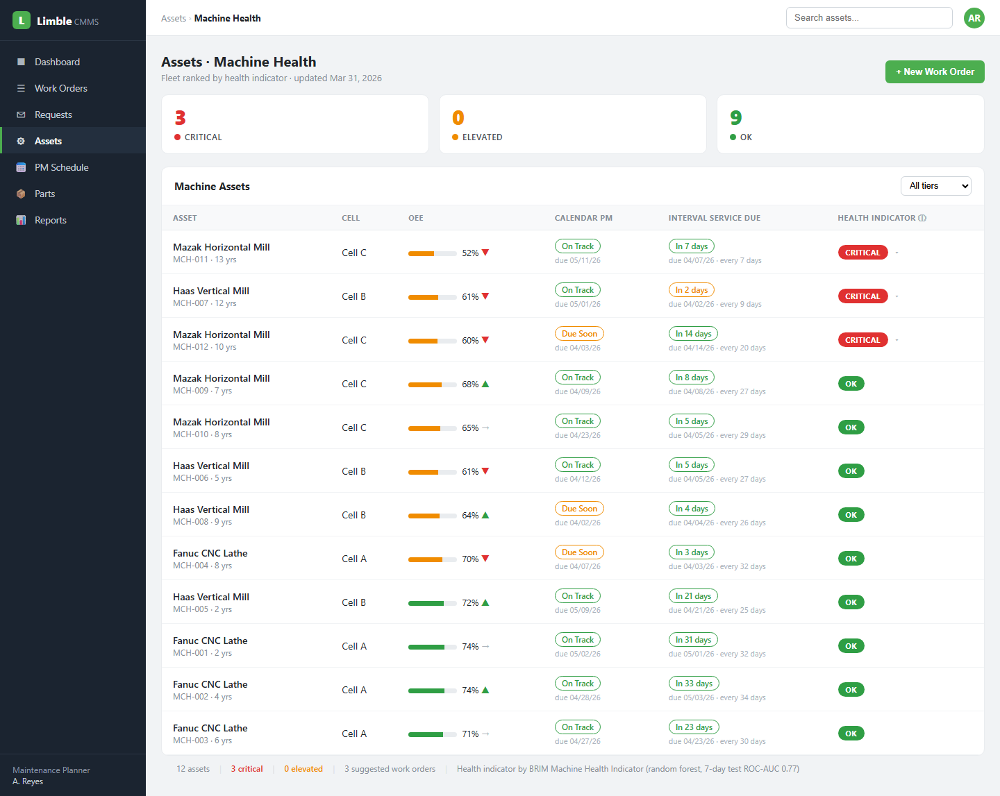
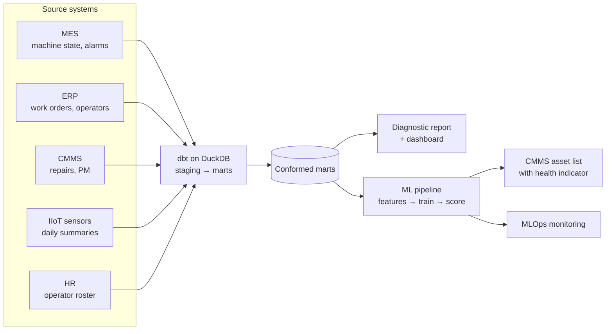

# OEE & Machine Health

**Data engineering, analytics and machine learning for a precision machining shop, applied to OEE, downtime and machine health.**

The project starts with **comprehensive data cleaning** of all five source systems (MES, ERP, CMMS, IIoT sensors, HR): fields were standardized and inconsistencies between systems were reconciled, duplicate rows were removed, and blank values were filled or flagged. A **data pipeline** was then built that integrates machine, order, maintenance, sensor and operator data from the five disconnected systems into a single modeled dataset. The pipeline is then **automated**: a monthly flow stages and tests each extract, rebuilds the data marts, report, and dashboard, and then retrains and rescores the model and runs the ML monitoring report.

An **analytics and ML layer** is built on the cleaned and integrated data:

1. **Analytics diagnostic report** on where OEE is lost, what drives unplanned downtime, and what it costs
2. **KPI dashboard** tracking OEE, downtime, and reliability (MTBF, MTTR) by machine, daily and monthly
3. **Machine learning model** that forecasts machine breakdowns and rates every machine daily as CRITICAL, ELEVATED or OK. Supported by technical documentation and monitoring in production

The OEE dashboard monitors daily machine health KPIs and provides monthly trends, with additional detail the user can scroll through:

[](https://brimsystems.github.io/mfg-data-engineering/oee_downtime/docs/reports/dashboard.html)

The ML model's machine health forecasts are embedded in the shop's CMMS asset list:

[](https://brimsystems.github.io/mfg-data-engineering/oee_downtime/docs/index.html)

> **[Open the CMMS asset list →](https://brimsystems.github.io/mfg-data-engineering/oee_downtime/docs/index.html)** · **[All six deliverables →](https://brimsystems.github.io/mfg-data-engineering/oee_downtime/)**

---

## Business Context

A precision machining shop (~$40M revenue) runs twelve CNC machines across three cells, with its three oldest mills installed more than nine years earlier. OEE across the fleet averaged 64.3% from January 2023 to March 2026 against a target of 85%. The shop was weighing whether to rebuild or replace these aging machines, as it knew they required more maintenance and underperformed the newer fleet in terms of availability and performance.

To support this decision, this project detailed each machine's availability, performance, and downtime, and then identified and quantified various actions the shop can take, including rebuilding or replacing the aging machines, among various other actions. Then, we implemented an OEE dashboard for daily monitoring of machine health KPIs, and introduced a new ML-driven forecast of each machine's health, embedded directly into the shop's CMMS.

By integrating the machines' condition-monitoring sensors with the shop's ERP, MES, CMMS, and HR records, new insights were surfaced on the drivers behind each machine's availability, performance, unplanned downtime, and maintenance needs. Six actions came out of it, from a reliability review on the oldest machines to a shift-start warm-up routine, worth about $566K a year in contribution margin if target levels were achieved.

The ML model embedded into the shop's CMMS labels each machine's current health as CRITICAL, ELEVATED, or OK, and ranks them by urgency. This was intended to supplement the shop's existing repair-interval maintenance process, enabling preventative maintenance actions on machines that were close to breaking down. We compared the effectiveness of this model against the current baseline: in its first three months live the shop logged 44 unplanned failures; the indicator read CRITICAL on at least one of the 7 days before 40 of them. Acting on those flags would have prevented 91% of the unplanned failures in the quarter against an 82% baseline level calculated off the shop's current repair-interval maintenance process. This would have avoided an estimated 29 hours of unplanned downtime in the quarter, about $13K a year in contribution margin. 

---

## Deliverables

| # | Deliverable | What it is | Links |
|---|---|---|---|
| 1 | CMMS asset list with the health indicator | The machine health indicator embedded in the shop's CMMS: each machine's health indicator, the drivers behind it, its PM status and current OEE, ranked by urgency. | [View](https://brimsystems.github.io/mfg-data-engineering/oee_downtime/docs/index.html) |
| 2 | Analytics diagnostic report | Where OEE is lost across availability and performance, the downtime Pareto and its cost, PM compliance, and the cross-system findings on alarms, PM status and operator setup. | [View](https://brimsystems.github.io/mfg-data-engineering/oee_downtime/docs/reports/analytics_report.html) |
| 3 | KPI dashboard | The recurring daily and monthly view of OEE, downtime, MTBF and MTTR by machine, with trends. | [View](https://brimsystems.github.io/mfg-data-engineering/oee_downtime/docs/reports/dashboard.html) |
| 4 | ML model overview & performance report | What the model forecasts, how it was trained, how it performed against baseline, and its limits. | [View](https://brimsystems.github.io/mfg-data-engineering/oee_downtime/docs/reports/model_overview.html) |
| 5 | ML technical report | Feature construction from the marts, the two target windows, the time-based split, model selection and tuning, calibration, thresholds, and the baseline comparison. | [View](https://brimsystems.github.io/mfg-data-engineering/oee_downtime/docs/reports/technical_report.html) |
| 6 | MLOps monitoring report | Monthly monitoring on performance, target, prediction and feature drift with a rules-based retraining decision. | [View](https://brimsystems.github.io/mfg-data-engineering/oee_downtime/docs/reports/monitoring_report.html) |

---

## Code

### Data pipeline: [`data_pipeline/models/`](data_pipeline/models/)

| Layer | What it is, does and contains |
|---|---|
| Staging | One model per source table (MES, ERP, CMMS, IIoT sensors, HR). Each cleans the raw extract into a consistent shape: types, units, timestamps, and the identifier each system uses. |
| Intermediate | Conforms the staged tables: shared machine, operator and shift dimensions (the HR employee number mapped to the ERP payroll number and the MES operator id), a time series of machine states, and a maintenance and failure event history with PM compliance flags, covering unplanned repairs, calendar PMs and interval services. |
| Marts | Analysis-ready tables the reports, dashboard and model read: OEE with its components by machine, day and month; downtime by type with the Pareto and cost; reliability by machine (MTBF, MTTR, the repair interval and when the interval service is due); PM compliance; operator setup; the machine health feature table with its rolling features and the 7- and 21-day targets; and, built after scoring, the ratings by machine and day and the scoring quarter's unplanned failures with the ratings before each. |

### Machine learning model: [`ml/src/`](ml/src/)

| File | What it does |
|---|---|
| `features.py` | Reads the feature mart (one row per machine, day and shift), adds the interaction flags, fills early gaps and declares the features and targets. |
| `training.py` | Trains, tunes and calibrates the candidate classifiers for each window, compares them with the rules and calendar PM baselines, selects and registers the best (a random forest on the current record). |
| `scoring.py` | Runs monthly batch scoring: the health indicator and its drivers for every machine and day. |
| `monitoring.py` | Performance, target, prediction and feature drift against reference windows, with the retraining rule. |

---

## How it works



Raw extracts from the five systems are staged, tested and conformed by a dbt pipeline into marts. The marts feed the diagnostic report and dashboard and the ML pipeline. The feature table is split by time into training, validation and test sets; candidate classifiers for each window are tuned, calibrated and compared with two baselines, and the best is registered. Scoring runs as a monthly batch inside the flow, and each period is monitored against training and validation references.

The monthly flow is defined in [`pipeline_flow.py`](pipeline_flow.py), with its schedule (first business day of the month, 06:00); training is run by hand when the monitoring verdict calls for it.

---

## Data

The datasets were generated to represent typical records from the source systems involved (MES, IIoT sensors, CMMS, ERP, and HR), so the full workflow can be demonstrated on data that is safe to share publicly; the [generators are in `data_source/generate/`](data_source/generate/).

---

## Running it locally

```bash
# 1. Environment
python3 -m venv .venv
source .venv/bin/activate          # Windows: .venv\Scripts\activate
pip install -e .                   # project + dependencies from pyproject.toml

# 2. Generate data and build the warehouse
python3 -m data_source.generate.run_generator
python3 -m data_source.generate.checks          # the checks the extracts are held to
cd data_pipeline && dbt build --exclude tag:after_scoring && cd ..

# 3. Analytics (diagnostic report + dashboard)
cd analytics/reports && python3 generate_analytics_report.py && cd ../..
cd analytics/dashboard && python3 generate_dashboard.py && cd ../..
python3 analytics/dashboard/capture_dashboard_screenshot.py   # optional: needs pip install -e ".[dev]"

# 4. ML lifecycle (train -> score -> monitor)
cd ml
python3 src/training.py            # trains, calibrates, selects and registers the health indicator
python3 src/ablation.py            # 7-day model without the sensor features (evaluation table only)
python3 src/scoring.py             # monthly batch scoring with SHAP drivers
cd ../data_pipeline && dbt build --select tag:after_scoring && cd ../ml   # the two marts that read the ratings
python3 src/monitoring.py          # four-layer drift and performance monitoring
cd ..

# 5. Client-facing report generators
cd ml/reports
python3 generate_cmms_dashboard.py
python3 capture_cmms_screenshot.py # optional: needs pip install -e ".[dev]"
python3 generate_model_overview.py
python3 generate_ml_technical.py
python3 generate_monitoring_report.py
cd ../..

# 6. The monthly flow: dbt build, the analytics generators, scoring, the second dbt
#    pass, monitoring and the four ML report generators in one run (training stays
#    manual, step 4)
python3 pipeline_flow.py
```

The report generators write standalone HTML; the copies served by GitHub Pages live under [`docs/`](docs/).

---

## Stack

| Layer | Tools |
|---|---|
| Integration & transformation | dbt, DuckDB |
| Analytics & reporting | Python, pandas, matplotlib, seaborn, HTML/CSS |
| Modeling | scikit-learn (random forest, the selected model), XGBoost (candidate), Optuna, SHAP |
| MLOps | MLflow (tracking & registry), Evidently (drift), Prefect (orchestration) |
| Delivery | Static HTML, GitHub Pages |

---

Brian Davis. Data engineering and applied analytics/ML for manufacturers. Other work: [github.com/brimsystems](https://github.com/brimsystems?tab=repositories).
